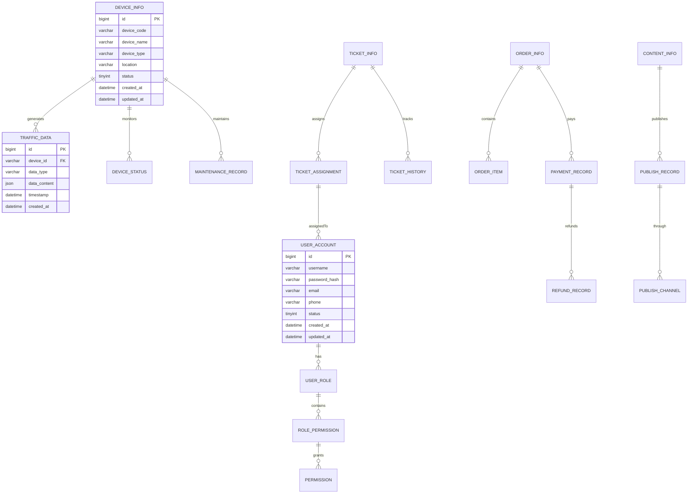

# 智慧城市综合交通管理与服务平台数据库设计说明书

**智慧城市科技有限公司编制**  
**二O二五年十一月**

## 版本历史

| 日期 | 版本 | 说明 | 作者 |
|------|------|------|------|
| 2025-11-07 | V1.0 | 初始版本 | 数据库设计师 |

---

## 目录

**一、引言** .................................................... 1  
1.1 编写目的 .................................................. 1  
1.2 文档约定 .................................................. 1  
1.3 预期读者和阅读建议 ........................................ 1  
1.4 参考文献 .................................................. 2  

**二、数据库命名规则** ........................................ 2  

**三、数据库设计说明** ........................................ 2  
3.1 数据库逻辑设计 ............................................ 2  
3.2 数据库物理设计 ............................................ 3  
3.3 数据库分布 ................................................ 4  
3.4 基表设计 .................................................. 5  
3.5 视图设计 ................................................. 12  
3.6 索引设计 ................................................. 13  
3.7 完整性约束 ............................................... 14  
3.8 授权设计 ................................................. 15  

**四、词汇表** ............................................... 16  

**五、历史数据处理** ......................................... 16  

---

## 一、引言

### 1.1 编写目的

本文档详细描述了智慧城市综合交通管理与服务平台的数据库结构设计，包括逻辑设计、物理设计、表结构定义、索引设计、约束设计等内容。

本文档为数据库开发人员、应用开发人员和系统运维人员提供数据库实施的详细指导，确保数据库设计满足系统功能和性能要求。

### 1.2 文档约定

**命名约定：**
- 数据库名称：小写字母+下划线，如 traffic_mgmt_db
- 表名：小写字母+下划线，如 user_info
- 字段名：小写字母+下划线，如 user_id
- 索引名：idx_表名_字段名，如 idx_user_info_username
- 约束名：约束类型_表名_字段名，如 pk_user_info_id

**数据类型约定：**
- 主键：BIGINT UNSIGNED AUTO_INCREMENT
- 外键：BIGINT UNSIGNED
- 字符串：VARCHAR(长度) 或 TEXT
- 时间：DATETIME 或 TIMESTAMP
- 金额：DECIMAL(10,2)
- 状态：TINYINT 或 ENUM

### 1.3 预期读者和阅读建议

**预期读者：**
- 数据库管理员：重点关注物理设计和性能优化
- 应用开发人员：重点关注表结构和约束设计
- 系统运维人员：重点关注备份和历史数据处理
- 测试工程师：重点关注数据完整性约束

### 1.4 参考文献

1. 《智慧城市综合交通管理与服务平台需求规约说明书》V1.1
2. 《MySQL 8.0参考手册》，Oracle Corporation
3. 《数据库设计规范》，阿里巴巴集团
4. 《高性能MySQL》，Baron Schwartz等著

---

## 二、数据库命名规则

本数据库设计遵循以下命名规则：

**数据库命名规则：**
- 主数据库：traffic_mgmt_main
- 日志数据库：traffic_mgmt_log  
- 时序数据库：traffic_mgmt_timeseries
- 缓存数据库：traffic_mgmt_cache

**表命名规则：**
- 业务表：按模块+功能命名，如 user_account, traffic_data
- 关联表：表1_表2，如 user_role, device_location
- 配置表：以config结尾，如 system_config
- 日志表：以log结尾，如 operation_log

**字段命名规则：**
- 主键：id
- 外键：关联表名_id，如 user_id
- 创建时间：created_at
- 更新时间：updated_at
- 删除标记：is_deleted
- 状态字段：status

---

## 三、数据库设计说明

### 3.1 数据库逻辑设计

系统采用分布式数据库架构，按业务领域和数据特性进行数据库划分：



### 3.2 数据库物理设计

**主数据库物理结构：**
- 存储引擎：InnoDB
- 字符集：utf8mb4
- 排序规则：utf8mb4_unicode_ci
- 行格式：DYNAMIC
- 分区策略：按时间分区（月分区）

**时序数据库物理结构：**
- 数据库：InfluxDB 2.7
- 存储策略：按设备ID分片
- 保留策略：原始数据保留1年，聚合数据保留5年
- 压缩策略：启用压缩，压缩比约70%

**缓存数据库物理结构：**
- 数据库：Redis 7.0 集群模式
- 内存分配：8GB
- 持久化：RDB + AOF
- 过期策略：allkeys-lru

### 3.3 数据库分布

| 数据库编号 | 数据库管理系统名称 | 数据库管理系统版本号 | 数据库英文名称 | 数据库中文名称 | 数据库安装物理位置 |
|------------|-------------------|---------------------|----------------|----------------|-------------------|
| DB001 | MySQL | 8.0.35 | traffic_mgmt_main | 交通管理主数据库 | 政务云数据中心/data/mysql/main |
| DB002 | MySQL | 8.0.35 | traffic_mgmt_log | 交通管理日志数据库 | 政务云数据中心/data/mysql/log |
| DB003 | InfluxDB | 2.7.3 | traffic_timeseries | 交通时序数据库 | 政务云数据中心/data/influxdb |
| DB004 | Redis | 7.0.12 | traffic_cache | 交通管理缓存数据库 | 政务云数据中心/data/redis |

### 3.4 基表设计

#### 3.4.1 用户管理相关表

**数据库编号：** DB001  
**基表编号：** T001  
**基表英文名称：** user_account  
**基表中文名称：** 用户账户表  

| 字段编号 | 英文字段名 | 中文字段名 | 字段类型 | 备注 |
|----------|------------|------------|----------|------|
| 1 | id | 用户ID | BIGINT UNSIGNED AUTO_INCREMENT | 主键 |
| 2 | username | 用户名 | VARCHAR(50) | 唯一索引，非空 |
| 3 | password_hash | 密码哈希 | VARCHAR(255) | BCrypt加密，非空 |
| 4 | email | 邮箱地址 | VARCHAR(100) | 唯一索引，可空 |
| 5 | phone | 手机号码 | VARCHAR(20) | 唯一索引，可空 |
| 6 | real_name | 真实姓名 | VARCHAR(50) | 可空 |
| 7 | department | 所属部门 | VARCHAR(100) | 可空 |
| 8 | status | 账户状态 | TINYINT | 0-禁用,1-启用,2-锁定 |
| 9 | last_login_at | 最后登录时间 | DATETIME | 可空 |
| 10 | login_count | 登录次数 | INT UNSIGNED | 默认0 |
| 11 | failed_attempts | 失败尝试次数 | TINYINT UNSIGNED | 默认0 |
| 12 | locked_until | 锁定到期时间 | DATETIME | 可空 |
| 13 | created_at | 创建时间 | DATETIME | 默认CURRENT_TIMESTAMP |
| 14 | updated_at | 更新时间 | DATETIME | 默认CURRENT_TIMESTAMP ON UPDATE CURRENT_TIMESTAMP |
| 15 | is_deleted | 删除标记 | TINYINT | 默认0，软删除 |

**说明：**
- 主关键字：id
- 唯一索引：username, email, phone
- 普通索引：status, created_at
- 外键约束：无

**数据库编号：** DB001  
**基表编号：** T002  
**基表英文名称：** role_info  
**基表中文名称：** 角色信息表  

| 字段编号 | 英文字段名 | 中文字段名 | 字段类型 | 备注 |
|----------|------------|------------|----------|------|
| 1 | id | 角色ID | BIGINT UNSIGNED AUTO_INCREMENT | 主键 |
| 2 | role_code | 角色编码 | VARCHAR(50) | 唯一索引，非空 |
| 3 | role_name | 角色名称 | VARCHAR(100) | 非空 |
| 4 | description | 角色描述 | TEXT | 可空 |
| 5 | status | 角色状态 | TINYINT | 0-禁用,1-启用 |
| 6 | created_at | 创建时间 | DATETIME | 默认CURRENT_TIMESTAMP |
| 7 | updated_at | 更新时间 | DATETIME | 默认CURRENT_TIMESTAMP ON UPDATE CURRENT_TIMESTAMP |
| 8 | is_deleted | 删除标记 | TINYINT | 默认0 |

#### 3.4.2 交通数据相关表

**数据库编号：** DB001  
**基表编号：** T003  
**基表英文名称：** device_info  
**基表中文名称：** 设备信息表  

| 字段编号 | 英文字段名 | 中文字段名 | 字段类型 | 备注 |
|----------|------------|------------|----------|------|
| 1 | id | 设备ID | BIGINT UNSIGNED AUTO_INCREMENT | 主键 |
| 2 | device_code | 设备编码 | VARCHAR(50) | 唯一索引，非空 |
| 3 | device_name | 设备名称 | VARCHAR(100) | 非空 |
| 4 | device_type | 设备类型 | VARCHAR(50) | 非空 |
| 5 | manufacturer | 制造商 | VARCHAR(100) | 可空 |
| 6 | model | 设备型号 | VARCHAR(100) | 可空 |
| 7 | location_name | 位置名称 | VARCHAR(200) | 可空 |
| 8 | longitude | 经度 | DECIMAL(10,7) | 可空 |
| 9 | latitude | 纬度 | DECIMAL(10,7) | 可空 |
| 10 | install_date | 安装日期 | DATE | 可空 |
| 11 | status | 设备状态 | TINYINT | 0-离线,1-在线,2-维护,3-故障 |
| 12 | ip_address | IP地址 | VARCHAR(45) | 可空，支持IPv6 |
| 13 | port | 端口号 | INT UNSIGNED | 可空 |
| 14 | protocol | 通信协议 | VARCHAR(20) | 可空 |
| 15 | created_at | 创建时间 | DATETIME | 默认CURRENT_TIMESTAMP |
| 16 | updated_at | 更新时间 | DATETIME | 默认CURRENT_TIMESTAMP ON UPDATE CURRENT_TIMESTAMP |
| 17 | is_deleted | 删除标记 | TINYINT | 默认0 |

**数据库编号：** DB003  
**基表编号：** T004  
**基表英文名称：** traffic_flow_data  
**基表中文名称：** 交通流量数据表（时序数据）  

| 字段编号 | 英文字段名 | 中文字段名 | 字段类型 | 备注 |
|----------|------------|------------|----------|------|
| 1 | time | 时间戳 | TIMESTAMP | 主键，时间索引 |
| 2 | device_id | 设备ID | STRING | 标签，索引 |
| 3 | lane_id | 车道ID | STRING | 标签，可空 |
| 4 | vehicle_count | 车辆数量 | INTEGER | 字段值 |
| 5 | avg_speed | 平均速度 | FLOAT | 字段值，km/h |
| 6 | occupancy | 占有率 | FLOAT | 字段值，百分比 |
| 7 | headway | 车头间距 | FLOAT | 字段值，秒 |
| 8 | density | 交通密度 | FLOAT | 字段值，辆/km |

#### 3.4.3 工单管理相关表

**数据库编号：** DB001  
**基表编号：** T005  
**基表英文名称：** ticket_info  
**基表中文名称：** 工单信息表  

| 字段编号 | 英文字段名 | 中文字段名 | 字段类型 | 备注 |
|----------|------------|------------|----------|------|
| 1 | id | 工单ID | BIGINT UNSIGNED AUTO_INCREMENT | 主键 |
| 2 | ticket_number | 工单编号 | VARCHAR(50) | 唯一索引，非空 |
| 3 | title | 工单标题 | VARCHAR(200) | 非空 |
| 4 | description | 详细描述 | TEXT | 可空 |
| 5 | category | 工单类别 | VARCHAR(50) | 非空 |
| 6 | priority | 优先级 | TINYINT | 1-低,2-中,3-高,4-紧急 |
| 7 | status | 工单状态 | TINYINT | 1-新建,2-分派,3-处理中,4-已解决,5-已关闭 |
| 8 | reporter_id | 报告人ID | BIGINT UNSIGNED | 外键，非空 |
| 9 | assignee_id | 分派人ID | BIGINT UNSIGNED | 外键，可空 |
| 10 | device_id | 相关设备ID | BIGINT UNSIGNED | 外键，可空 |
| 11 | location | 位置信息 | VARCHAR(200) | 可空 |
| 12 | attachment_urls | 附件URL | JSON | 可空 |
| 13 | estimated_hours | 预计工时 | DECIMAL(5,2) | 可空 |
| 14 | actual_hours | 实际工时 | DECIMAL(5,2) | 可空 |
| 15 | due_date | 截止日期 | DATETIME | 可空 |
| 16 | resolved_at | 解决时间 | DATETIME | 可空 |
| 17 | closed_at | 关闭时间 | DATETIME | 可空 |
| 18 | created_at | 创建时间 | DATETIME | 默认CURRENT_TIMESTAMP |
| 19 | updated_at | 更新时间 | DATETIME | 默认CURRENT_TIMESTAMP ON UPDATE CURRENT_TIMESTAMP |

#### 3.4.4 支付管理相关表

**数据库编号：** DB001  
**基表编号：** T006  
**基表英文名称：** order_info  
**基表中文名称：** 订单信息表  

| 字段编号 | 英文字段名 | 中文字段名 | 字段类型 | 备注 |
|----------|------------|------------|----------|------|
| 1 | id | 订单ID | BIGINT UNSIGNED AUTO_INCREMENT | 主键 |
| 2 | order_number | 订单编号 | VARCHAR(50) | 唯一索引，非空 |
| 3 | user_id | 用户ID | BIGINT UNSIGNED | 外键，非空 |
| 4 | order_type | 订单类型 | VARCHAR(50) | 非空 |
| 5 | total_amount | 订单总额 | DECIMAL(10,2) | 非空 |
| 6 | discount_amount | 优惠金额 | DECIMAL(10,2) | 默认0.00 |
| 7 | actual_amount | 实付金额 | DECIMAL(10,2) | 非空 |
| 8 | currency | 货币类型 | VARCHAR(10) | 默认'CNY' |
| 9 | status | 订单状态 | TINYINT | 1-待付款,2-已付款,3-已完成,4-已取消 |
| 10 | description | 订单描述 | VARCHAR(500) | 可空 |
| 11 | metadata | 元数据 | JSON | 可空 |
| 12 | expires_at | 过期时间 | DATETIME | 可空 |
| 13 | paid_at | 支付时间 | DATETIME | 可空 |
| 14 | completed_at | 完成时间 | DATETIME | 可空 |
| 15 | created_at | 创建时间 | DATETIME | 默认CURRENT_TIMESTAMP |
| 16 | updated_at | 更新时间 | DATETIME | 默认CURRENT_TIMESTAMP ON UPDATE CURRENT_TIMESTAMP |

**数据库编号：** DB001  
**基表编号：** T007  
**基表英文名称：** payment_record  
**基表中文名称：** 支付记录表  

| 字段编号 | 英文字段名 | 中文字段名 | 字段类型 | 备注 |
|----------|------------|------------|----------|------|
| 1 | id | 支付记录ID | BIGINT UNSIGNED AUTO_INCREMENT | 主键 |
| 2 | transaction_id | 交易ID | VARCHAR(100) | 唯一索引，非空 |
| 3 | order_id | 订单ID | BIGINT UNSIGNED | 外键，非空 |
| 4 | payment_method | 支付方式 | VARCHAR(50) | 非空 |
| 5 | payment_channel | 支付渠道 | VARCHAR(50) | 非空 |
| 6 | amount | 支付金额 | DECIMAL(10,2) | 非空 |
| 7 | currency | 货币类型 | VARCHAR(10) | 默认'CNY' |
| 8 | status | 支付状态 | TINYINT | 1-待支付,2-支付中,3-成功,4-失败,5-已退款 |
| 9 | third_party_id | 第三方交易号 | VARCHAR(100) | 可空 |
| 10 | callback_data | 回调数据 | JSON | 可空 |
| 11 | failure_reason | 失败原因 | VARCHAR(500) | 可空 |
| 12 | paid_at | 支付时间 | DATETIME | 可空 |
| 13 | created_at | 创建时间 | DATETIME | 默认CURRENT_TIMESTAMP |
| 14 | updated_at | 更新时间 | DATETIME | 默认CURRENT_TIMESTAMP ON UPDATE CURRENT_TIMESTAMP |

### 3.5 视图设计

**数据库编号：** DB001  
**视图编号：** V001  
**视图英文名称：** user_role_view  
**视图中文名称：** 用户角色视图  
**相关基表和视图：** user_account, user_role, role_info  

| 字段编号 | 英文字段名 | 中文字段名 | 字段类型 | 字段源 | 备注 |
|----------|------------|------------|----------|--------|------|
| 1 | user_id | 用户ID | BIGINT | user_account.id | 主键 |
| 2 | username | 用户名 | VARCHAR(50) | user_account.username | 非空 |
| 3 | real_name | 真实姓名 | VARCHAR(50) | user_account.real_name | 可空 |
| 4 | role_id | 角色ID | BIGINT | role_info.id | 可空 |
| 5 | role_code | 角色编码 | VARCHAR(50) | role_info.role_code | 可空 |
| 6 | role_name | 角色名称 | VARCHAR(100) | role_info.role_name | 可空 |
| 7 | user_status | 用户状态 | TINYINT | user_account.status | 非空 |
| 8 | role_status | 角色状态 | TINYINT | role_info.status | 可空 |

**视图创建SQL：**
```sql
CREATE VIEW user_role_view AS
SELECT 
    u.id AS user_id,
    u.username,
    u.real_name,
    r.id AS role_id,
    r.role_code,
    r.role_name,
    u.status AS user_status,
    r.status AS role_status
FROM user_account u
LEFT JOIN user_role ur ON u.id = ur.user_id
LEFT JOIN role_info r ON ur.role_id = r.id
WHERE u.is_deleted = 0 AND (r.is_deleted = 0 OR r.is_deleted IS NULL);
```

### 3.6 索引设计

**数据库编号：** DB001  

| 索引编号 | 基表名称 | 索引名称 | 字段集名称 | 备注 |
|----------|----------|----------|------------|------|
| IDX001 | user_account | idx_user_username | username | 唯一索引，登录查询 |
| IDX002 | user_account | idx_user_email | email | 唯一索引，邮箱登录 |
| IDX003 | user_account | idx_user_phone | phone | 唯一索引，手机登录 |
| IDX004 | user_account | idx_user_status | status | 普通索引，状态查询 |
| IDX005 | user_account | idx_user_created | created_at | 普通索引，时间查询 |
| IDX006 | device_info | idx_device_code | device_code | 唯一索引，设备查询 |
| IDX007 | device_info | idx_device_type | device_type | 普通索引，类型查询 |
| IDX008 | device_info | idx_device_status | status | 普通索引，状态查询 |
| IDX009 | device_info | idx_device_location | longitude, latitude | 复合索引，地理查询 |
| IDX010 | ticket_info | idx_ticket_number | ticket_number | 唯一索引，工单查询 |
| IDX011 | ticket_info | idx_ticket_status | status | 普通索引，状态查询 |
| IDX012 | ticket_info | idx_ticket_assignee | assignee_id | 普通索引，分派查询 |
| IDX013 | ticket_info | idx_ticket_created | created_at | 普通索引，时间查询 |
| IDX014 | order_info | idx_order_number | order_number | 唯一索引，订单查询 |
| IDX015 | order_info | idx_order_user | user_id | 普通索引，用户订单 |
| IDX016 | order_info | idx_order_status | status | 普通索引，状态查询 |
| IDX017 | payment_record | idx_payment_transaction | transaction_id | 唯一索引，交易查询 |
| IDX018 | payment_record | idx_payment_order | order_id | 普通索引，订单支付 |

### 3.7 完整性约束

**数据库编号：** DB001  

| 约束编号 | 完整性名称 | 基表名 | 字段名 | 约束表达式 | 备注 |
|----------|------------|--------|--------|------------|------|
| C001 | 用户名唯一性 | user_account | username | UNIQUE(username) | 确保用户名不重复 |
| C002 | 邮箱格式约束 | user_account | email | email REGEXP '^[A-Za-z0-9._%+-]+@[A-Za-z0-9.-]+\.[A-Za-z]{2,}$' | 邮箱格式验证 |
| C003 | 手机号格式约束 | user_account | phone | phone REGEXP '^1[3-9][0-9]{9}$' | 中国手机号格式 |
| C004 | 用户状态约束 | user_account | status | status IN (0,1,2) | 状态值限制 |
| C005 | 设备编码唯一性 | device_info | device_code | UNIQUE(device_code) | 设备编码不重复 |
| C006 | 经纬度范围约束 | device_info | longitude, latitude | longitude BETWEEN -180 AND 180 AND latitude BETWEEN -90 AND 90 | 地理坐标范围 |
| C007 | 工单编号唯一性 | ticket_info | ticket_number | UNIQUE(ticket_number) | 工单编号不重复 |
| C008 | 优先级约束 | ticket_info | priority | priority IN (1,2,3,4) | 优先级值限制 |
| C009 | 订单金额约束 | order_info | total_amount, actual_amount | total_amount >= 0 AND actual_amount >= 0 | 金额非负 |
| C010 | 支付金额约束 | payment_record | amount | amount > 0 | 支付金额必须大于0 |

**外键约束：**
```sql
-- 用户角色关联外键
ALTER TABLE user_role 
ADD CONSTRAINT fk_user_role_user 
FOREIGN KEY (user_id) REFERENCES user_account(id) ON DELETE CASCADE;

ALTER TABLE user_role 
ADD CONSTRAINT fk_user_role_role 
FOREIGN KEY (role_id) REFERENCES role_info(id) ON DELETE CASCADE;

-- 工单外键约束
ALTER TABLE ticket_info 
ADD CONSTRAINT fk_ticket_reporter 
FOREIGN KEY (reporter_id) REFERENCES user_account(id);

ALTER TABLE ticket_info 
ADD CONSTRAINT fk_ticket_assignee 
FOREIGN KEY (assignee_id) REFERENCES user_account(id);

-- 支付记录外键约束
ALTER TABLE payment_record 
ADD CONSTRAINT fk_payment_order 
FOREIGN KEY (order_id) REFERENCES order_info(id);
```

### 3.8 授权设计

**数据库编号：** DB001  

| 授权编号 | 用户名称 | 对象名称 | 权限 | 备注 |
|----------|----------|----------|------|------|
| AUTH001 | app_user | user_account | SELECT, INSERT, UPDATE | 应用用户权限 |
| AUTH002 | app_user | role_info | SELECT | 应用用户只读角色 |
| AUTH003 | app_user | device_info | SELECT, INSERT, UPDATE | 设备管理权限 |
| AUTH004 | app_user | traffic_flow_data | SELECT, INSERT | 交通数据权限 |
| AUTH005 | app_user | ticket_info | SELECT, INSERT, UPDATE | 工单管理权限 |
| AUTH006 | app_user | order_info | SELECT, INSERT, UPDATE | 订单管理权限 |
| AUTH007 | app_user | payment_record | SELECT, INSERT, UPDATE | 支付记录权限 |
| AUTH008 | readonly_user | ALL_TABLES | SELECT | 只读用户权限 |
| AUTH009 | admin_user | ALL_TABLES | ALL PRIVILEGES | 管理员全部权限 |
| AUTH010 | backup_user | ALL_TABLES | SELECT, LOCK TABLES | 备份用户权限 |

**权限创建SQL：**
```sql
-- 创建应用用户
CREATE USER 'app_user'@'%' IDENTIFIED BY 'SecurePassword123!';
GRANT SELECT, INSERT, UPDATE ON traffic_mgmt_main.* TO 'app_user'@'%';

-- 创建只读用户
CREATE USER 'readonly_user'@'%' IDENTIFIED BY 'ReadOnlyPass123!';
GRANT SELECT ON traffic_mgmt_main.* TO 'readonly_user'@'%';

-- 创建管理员用户
CREATE USER 'admin_user'@'localhost' IDENTIFIED BY 'AdminPassword123!';
GRANT ALL PRIVILEGES ON traffic_mgmt_main.* TO 'admin_user'@'localhost';

-- 创建备份用户
CREATE USER 'backup_user'@'localhost' IDENTIFIED BY 'BackupPassword123!';
GRANT SELECT, LOCK TABLES ON traffic_mgmt_main.* TO 'backup_user'@'localhost';
```

---

## 四、词汇表

| 术语 | 英文全称 | 定义 |
|------|----------|------|
| 主键 | Primary Key | 唯一标识表中每一行的字段或字段组合 |
| 外键 | Foreign Key | 引用另一个表主键的字段，用于建立表间关系 |
| 索引 | Index | 提高数据查询速度的数据结构 |
| 约束 | Constraint | 限制表中数据的规则，保证数据完整性 |
| 视图 | View | 基于一个或多个表的虚拟表 |
| 分区 | Partition | 将大表分割成更小、更易管理的部分 |
| 时序数据 | Time Series Data | 按时间顺序排列的数据点序列 |
| 软删除 | Soft Delete | 通过标记字段逻辑删除数据，而非物理删除 |

---

## 五、历史数据处理

### 5.1 数据归档策略

**交通流量数据归档：**
- **保留策略：** 原始数据保留1年，聚合数据保留5年
- **归档周期：** 每月归档上月数据
- **归档方式：** 自动归档，使用定时任务
- **存储位置：** 归档数据存储在对象存储中，压缩后存储

**日志数据归档：**
- **保留策略：** 操作日志保留2年，系统日志保留1年
- **归档周期：** 每周归档
- **压缩方式：** 使用gzip压缩，压缩比约80%

**业务数据归档：**
- **订单数据：** 已完成订单3年后归档
- **工单数据：** 已关闭工单2年后归档
- **用户数据：** 注销用户1年后归档

### 5.2 数据清理策略

**临时数据清理：**
- **会话数据：** 过期会话立即清理
- **验证码数据：** 过期验证码每小时清理
- **临时文件：** 超过7天的临时文件自动清理

**缓存数据清理：**
- **Redis缓存：** 使用TTL自动过期
- **应用缓存：** 使用LRU策略自动清理
- **CDN缓存：** 根据业务需求设置过期时间

### 5.3 数据备份策略

**全量备份：**
- **频率：** 每周日凌晨2点执行全量备份
- **保留期：** 全量备份保留3个月
- **存储位置：** 备份数据存储在异地机房

**增量备份：**
- **频率：** 每日凌晨1点执行增量备份
- **保留期：** 增量备份保留1个月
- **验证机制：** 每次备份后进行完整性验证

**实时备份：**
- **binlog备份：** 实时同步到备用数据库
- **关键数据：** 支付数据实时双写
- **监控告警：** 备份失败立即告警

---

**文档编制完成日期：** 2025年11月7日  
**文档审核人员：** 数据库架构师、开发经理、运维经理  
**文档审核状态：** 待审核  
**文档存档位置：** 项目文档管理系统 /docs/database-design/  
**文档密级：** 内部文件