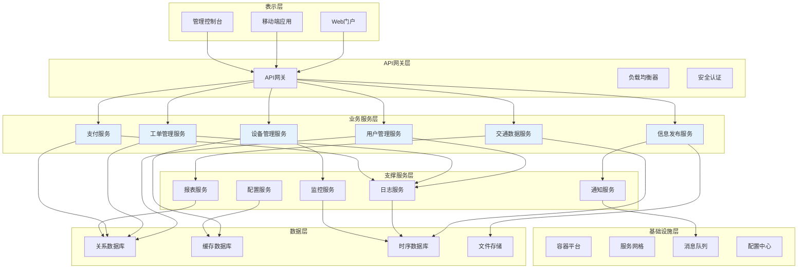

# 智慧城市综合交通管理与服务平台软件概要设计说明书

**智慧城市科技有限公司编制**  
**二O二五年十一月**

## 版本历史

| 日期 | 版本 | 说明 | 作者 |
|------|------|------|------|
| 2025-11-07 | V1.0 | 初始版本 | 系统架构师 |

---

## 目录

**一、引言** .................................................... 1  
1.1 编写目的 .................................................. 1  
1.2 预期读者和阅读建议 ........................................ 1  
1.3 参考文献 .................................................. 1  

**二、设计概述** .............................................. 2  
2.1 限制和约束 ................................................ 2  
2.2 设计原则和设计要求 ........................................ 2  

**三、系统逻辑设计** .......................................... 3  
3.1 系统组织设计 .............................................. 3  
3.2 系统结构设计 .............................................. 4  
3.3 系统接口设计 .............................................. 6  
3.4 系统完整性设计 ............................................ 8  

**四、系统出错处理设计** ...................................... 9  
4.1 系统出错处理表 ............................................ 9  
4.2 维护处理过程表 ........................................... 10  

**五、技术设计** ............................................. 11  
5.1 系统开发技术说明表 ....................................... 11  
5.2 开发技术应用说明 ......................................... 12  

**六、数据库设计** ........................................... 13  

**七、词汇表** ............................................... 13  

**八、进度计划** ............................................. 14  

---

## 一、引言

### 1.1 编写目的

本文档是基于《智慧城市综合交通管理与服务平台需求规约说明书》编写的软件概要设计说明书，旨在详细描述该软件产品的系统架构、模块设计、接口设计和技术实现方案。

本文档为后续的详细设计、编码实现、系统测试和项目管理提供技术依据和指导，确保开发团队对系统整体架构和设计思路有统一的理解。

### 1.2 预期读者和阅读建议

**预期读者包括：**
- 系统架构师和高级开发工程师
- 项目经理和技术负责人
- 数据库设计师和运维工程师
- 测试工程师和质量保证人员
- 客户方技术人员

**阅读建议：**
- 系统架构师重点关注第三章系统逻辑设计
- 开发工程师重点关注第五章技术设计
- 项目经理重点关注第八章进度计划
- 测试工程师重点关注第四章出错处理设计

### 1.3 参考文献

1. 《智慧城市综合交通管理与服务平台需求规约说明书》V1.1，智慧城市科技有限公司，2025年10月
2. 《软件工程 软件设计说明》（GB/T 8567-2006），国家标准化管理委员会
3. 《软件架构设计模式》，Martin Fowler，机械工业出版社，2019年
4. 《微服务架构设计》，Chris Richardson，人民邮电出版社，2018年
5. 《Spring Boot微服务实战》，翟永超，电子工业出版社，2020年

---

## 二、设计概述

### 2.1 限制和约束

**技术约束：**
- 必须采用Java 11或以上版本进行后端开发
- 前端必须支持主流浏览器（Chrome、Firefox、Edge、Safari）
- 数据库必须支持MySQL 8.0或PostgreSQL 13
- 系统必须支持容器化部署（Docker + Kubernetes）
- 必须符合国家网络安全等级保护三级要求

**性能约束：**
- 系统响应时间：普通查询≤3秒，复杂报表≤30秒
- 并发用户数：≥10000个同时在线用户
- 系统可用性：≥99.5%年度可用性
- 数据处理能力：≥1000条/分钟数据录入

**环境约束：**
- 必须在政务云环境中部署
- 支持7×24小时不间断运行
- 数据存储容量：支持至少5年历史数据
- 网络带宽：支持高并发访问需求

### 2.2 设计原则和设计要求

**设计原则：**

1. **模块化设计原则**
   - 采用微服务架构，各业务模块独立部署
   - 高内聚、低耦合的模块设计
   - 支持模块的独立开发、测试和维护

2. **可扩展性原则**
   - 支持水平扩展和垂直扩展
   - 采用分布式架构设计
   - 支持负载均衡和集群部署

3. **安全性原则**
   - 多层次安全防护体系
   - 数据加密存储和传输
   - 完善的权限管理和审计机制

4. **可靠性原则**
   - 容错设计和故障自动恢复
   - 数据备份和灾难恢复机制
   - 系统监控和预警机制

**设计要求：**

1. **系统架构要求**
   - 采用分层架构：表示层、业务层、数据访问层
   - 使用微服务架构模式
   - 实现前后端分离设计

2. **数据库设计要求**
   - 遵循数据库设计规范（1NF、2NF、3NF）
   - 支持读写分离和分库分表
   - 建立完善的索引和约束机制

3. **接口设计要求**
   - 采用RESTful API设计风格
   - 统一的接口规范和错误处理
   - 完善的API文档和版本管理

4. **安全设计要求**
   - 实施RBAC权限管理模型
   - 支持OAuth 2.0和JWT认证
   - 实现API限流和防护机制

---

## 三、系统逻辑设计

### 3.1 系统组织设计

系统采用微服务架构，按业务领域划分为以下子系统：

| 子系统编号 | 英文名称 | 中文名称 | 业务职能 | 安装地点 | 备注 |
|------------|----------|----------|----------|----------|------|
| SYS001 | user-management | 用户管理子系统 | 用户认证、权限管理、角色分配 | 政务云数据中心 | 核心服务 |
| SYS002 | traffic-data | 交通数据管理子系统 | 数据采集、存储、分析、查询 | 政务云数据中心 | 核心服务 |
| SYS003 | device-management | 设备管理子系统 | 设备监控、故障处理、维护管理 | 政务云数据中心 | 核心服务 |
| SYS004 | info-publish | 信息发布子系统 | 内容编辑、审核、多渠道发布 | 政务云数据中心 | 业务服务 |
| SYS005 | ticket-management | 工单管理子系统 | 工单创建、分派、处理、跟踪 | 政务云数据中心 | 业务服务 |
| SYS006 | payment-service | 支付服务子系统 | 费用计算、在线支付、退款处理 | 政务云数据中心 | 业务服务 |
| SYS007 | log-management | 日志管理子系统 | 日志收集、存储、查询、分析 | 政务云数据中心 | 支撑服务 |
| SYS008 | report-service | 报表服务子系统 | 报表生成、统计分析、数据导出 | 政务云数据中心 | 支撑服务 |
| SYS009 | config-management | 配置管理子系统 | 系统配置、参数管理、配置分发 | 政务云数据中心 | 支撑服务 |
| SYS010 | monitor-service | 监控服务子系统 | 系统监控、性能分析、告警通知 | 政务云数据中心 | 支撑服务 |
| SYS011 | api-gateway | API网关 | 请求路由、负载均衡、安全认证 | 政务云数据中心 | 基础服务 |
| SYS012 | web-portal | Web门户 | 用户界面、前端展示、交互处理 | 政务云数据中心 | 表示层 |

### 3.2 系统结构设计

#### 3.2.1 系统特性表

**子系统编号：** SYS001  
**子系统英文名称：** user-management  
**子系统中文名称：** 用户管理子系统  

| 特性编号 | 系统特征英文名称 | 系统特征中文名称 | 操作功能 | 调用对象 | 被调用对象 | 备注 |
|----------|------------------|------------------|----------|----------|------------|------|
| F001 | userAuthentication | 用户认证 | 验证用户身份，生成访问令牌 | API网关 | 数据库服务 | 核心功能 |
| F002 | roleManagement | 角色管理 | 创建、修改、删除用户角色 | Web门户 | 数据库服务 | 管理功能 |
| F003 | permissionControl | 权限控制 | 检查用户操作权限 | 各业务服务 | 缓存服务 | 核心功能 |
| F004 | userProfileMgmt | 用户档案管理 | 管理用户基本信息 | Web门户 | 数据库服务 | 基础功能 |

**子系统编号：** SYS002  
**子系统英文名称：** traffic-data  
**子系统中文名称：** 交通数据管理子系统  

| 特性编号 | 系统特征英文名称 | 系统特征中文名称 | 操作功能 | 调用对象 | 被调用对象 | 备注 |
|----------|------------------|------------------|----------|----------|------------|------|
| F005 | dataCollection | 数据采集 | 从各种数据源采集交通数据 | 外部设备接口 | 消息队列 | 核心功能 |
| F006 | dataValidation | 数据验证 | 验证数据格式和业务规则 | 数据采集服务 | 规则引擎 | 质量保证 |
| F007 | dataStorage | 数据存储 | 将验证后的数据存储到数据库 | 数据验证服务 | 数据库服务 | 核心功能 |
| F008 | dataQuery | 数据查询 | 提供数据查询和检索服务 | Web门户 | 数据库服务 | 基础功能 |
| F009 | dataAnalysis | 数据分析 | 对交通数据进行统计分析 | 报表服务 | 分析引擎 | 高级功能 |

#### 3.2.2 系统特性结构图

### 3.3 系统接口设计

#### 3.3.1 系统接口表

**子系统编号：** SYS001  
**子系统英文名称：** user-management  
**子系统中文名称：** 用户管理子系统  

| 接口编号 | 接口名称 | 接口类型 | 接口性质 | 接口速率 | 接口协议 | 备注 |
|----------|----------|----------|----------|----------|----------|------|
| I001 | 用户认证接口 | REST API | 输入 | 1000次/秒 | HTTPS | 核心接口 |
| I002 | 权限验证接口 | REST API | 双向 | 2000次/秒 | HTTPS | 高频调用 |
| I003 | 用户信息接口 | REST API | 输出 | 500次/秒 | HTTPS | 查询接口 |
| I004 | 角色管理接口 | REST API | 双向 | 100次/秒 | HTTPS | 管理接口 |

**子系统编号：** SYS002  
**子系统英文名称：** traffic-data  
**子系统中文名称：** 交通数据管理子系统  

| 接口编号 | 接口名称 | 接口类型 | 接口性质 | 接口速率 | 接口协议 | 备注 |
|----------|----------|----------|----------|----------|----------|------|
| I005 | 数据采集接口 | REST API | 输入 | 5000次/秒 | HTTPS | 高并发接口 |
| I006 | 数据查询接口 | REST API | 输出 | 3000次/秒 | HTTPS | 查询接口 |
| I007 | 批量导入接口 | REST API | 输入 | 10次/秒 | HTTPS | 大数据接口 |
| I008 | 数据同步接口 | WebSocket | 双向 | 持续连接 | WSS | 实时同步 |

#### 3.3.2 系统接口传输协议说明

**REST API接口协议：**
- 协议版本：HTTP/1.1 和 HTTP/2
- 安全协议：TLS 1.3
- 数据格式：JSON
- 字符编码：UTF-8
- 认证方式：JWT Bearer Token
- 限流策略：令牌桶算法

**WebSocket接口协议：**
- 协议版本：RFC 6455
- 安全协议：WSS (WebSocket Secure)
- 心跳间隔：30秒
- 重连机制：指数退避算法
- 消息格式：JSON

**数据库接口协议：**
- 连接协议：JDBC 4.2
- 连接池：HikariCP
- 事务隔离级别：READ_COMMITTED
- 超时设置：连接超时30秒，查询超时60秒

### 3.4 系统完整性设计

**子系统编号：** SYS001  
**子系统英文名称：** user-management  
**子系统中文名称：** 用户管理子系统  

| 约束编号 | 完整性名称 | 相关对象名 | 约束表达式 | 备注 |
|----------|------------|------------|------------|------|
| C001 | 用户名唯一性 | User.username | UNIQUE(username) | 确保用户名不重复 |
| C002 | 密码强度约束 | User.password | LENGTH(password) >= 8 AND REGEX(password, '^(?=.*[a-z])(?=.*[A-Z])(?=.*\d)(?=.*[@$!%*?&])[A-Za-z\d@$!%*?&]') | 密码复杂度要求 |
| C003 | 角色权限关联 | Role, Permission | EXISTS(role_permission WHERE role_id = Role.id AND permission_id = Permission.id) | 角色必须有权限 |
| C004 | 用户状态有效性 | User.status | status IN ('ACTIVE', 'INACTIVE', 'LOCKED', 'EXPIRED') | 状态值约束 |

**子系统编号：** SYS002  
**子系统英文名称：** traffic-data  
**子系统中文名称：** 交通数据管理子系统  

| 约束编号 | 完整性名称 | 相关对象名 | 约束表达式 | 备注 |
|----------|------------|------------|------------|------|
| C005 | 数据时间有效性 | TrafficData.timestamp | timestamp <= CURRENT_TIMESTAMP AND timestamp >= CURRENT_TIMESTAMP - INTERVAL '1 DAY' | 数据时间合理性 |
| C006 | 流量数据非负 | TrafficData.flow_count | flow_count >= 0 | 流量不能为负数 |
| C007 | 速度数据范围 | TrafficData.speed | speed >= 0 AND speed <= 200 | 速度合理范围 |
| C008 | 设备ID有效性 | TrafficData.device_id | EXISTS(Device WHERE id = TrafficData.device_id) | 设备必须存在 |

---

## 四、系统出错处理设计

### 4.1 系统出错处理表

**子系统编号：** SYS001  
**子系统英文名称：** user-management  
**子系统中文名称：** 用户管理子系统  

| 错误编号 | 错误名称 | 错误原因 | 错误信息 | 处理方式 | 备注 |
|----------|----------|----------|----------|----------|------|
| E001 | 用户认证失败 | 用户名或密码错误 | "用户名或密码错误，请重新输入" | 返回登录页面，记录失败次数 | 3次失败锁定账户 |
| E002 | 账户被锁定 | 连续登录失败次数过多 | "账户已被锁定，请30分钟后重试或联系管理员" | 拒绝登录，显示解锁时间 | 自动解锁或管理员解锁 |
| E003 | 权限不足 | 用户无相应操作权限 | "您没有执行此操作的权限，请联系管理员" | 拒绝操作，记录越权尝试 | 安全审计 |
| E004 | 会话过期 | 用户会话超时 | "会话已过期，请重新登录" | 跳转到登录页面 | 清除本地缓存 |

**子系统编号：** SYS002  
**子系统英文名称：** traffic-data  
**子系统中文名称：** 交通数据管理子系统  

| 错误编号 | 错误名称 | 错误原因 | 错误信息 | 处理方式 | 备注 |
|----------|----------|----------|----------|----------|------|
| E005 | 数据格式错误 | 输入数据不符合格式要求 | "数据格式错误，请检查输入格式" | 返回错误详情，拒绝保存 | 提供格式示例 |
| E006 | 数据库连接失败 | 数据库服务不可用 | "系统暂时不可用，请稍后重试" | 启用备用数据库，通知运维 | 自动故障转移 |
| E007 | 数据重复 | 相同时间点设备数据重复 | "检测到重复数据，是否覆盖现有数据？" | 提供选择选项 | 用户确认后处理 |
| E008 | 存储空间不足 | 磁盘空间不足 | "存储空间不足，请联系系统管理员" | 停止数据写入，发送告警 | 紧急扩容 |

### 4.2 维护处理过程表

**子系统编号：** SYS001  
**子系统英文名称：** user-management  
**子系统中文名称：** 用户管理子系统  

| 错误编号 | 处理过程英文名称 | 处理过程中文名称 | 处理功能 | 入口参数 | 出口参数 | 备注 |
|----------|------------------|------------------|----------|----------|----------|------|
| E001 | handleAuthFailure | 处理认证失败 | 记录失败次数，判断是否锁定 | userId, failureCount | lockStatus, remainingAttempts | 防暴力破解 |
| E002 | unlockAccount | 解锁账户 | 重置失败次数，解除锁定状态 | userId, unlockReason | unlockResult | 管理员操作 |
| E003 | logUnauthorizedAccess | 记录越权访问 | 记录越权尝试，发送安全告警 | userId, resource, action | logId | 安全审计 |
| E004 | refreshSession | 刷新会话 | 延长会话有效期 | sessionId, userId | newSessionId, expireTime | 自动续期 |

**子系统编号：** SYS002  
**子系统英文名称：** traffic-data  
**子系统中文名称：** 交通数据管理子系统  

| 错误编号 | 处理过程英文名称 | 处理过程中文名称 | 处理功能 | 入口参数 | 出口参数 | 备注 |
|----------|------------------|------------------|----------|----------|----------|------|
| E005 | validateDataFormat | 验证数据格式 | 检查数据格式，返回验证结果 | inputData, schema | validationResult, errorDetails | 数据质量保证 |
| E006 | switchToBackupDB | 切换备用数据库 | 自动切换到备用数据库 | primaryDBStatus | switchResult, backupDBStatus | 高可用保证 |
| E007 | handleDuplicateData | 处理重复数据 | 检测并处理重复数据 | newData, existingData | mergeResult, conflictInfo | 数据一致性 |
| E008 | expandStorage | 扩展存储空间 | 自动扩展存储或清理历史数据 | currentUsage, threshold | expansionResult, newCapacity | 存储管理 |

---

## 五、技术设计

### 5.1 系统开发技术说明表

**子系统编号：** SYS001  
**子系统英文名称：** user-management  
**子系统中文名称：** 用户管理子系统  

| 技术编号 | 开发技术英文名称 | 开发技术中文名称 | 处理功能 | 系统特性编号 | 备注 |
|----------|------------------|------------------|----------|--------------|------|
| T001 | Spring Security | Spring安全框架 | 用户认证和授权 | F001, F003 | 安全核心框架 |
| T002 | JWT | JSON Web Token | 无状态身份验证 | F001 | 分布式认证 |
| T003 | BCrypt | 密码加密算法 | 密码安全存储 | F001 | 单向加密 |
| T004 | Redis | 内存数据库 | 会话和权限缓存 | F003 | 高性能缓存 |

**子系统编号：** SYS002  
**子系统英文名称：** traffic-data  
**子系统中文名称：** 交通数据管理子系统  

| 技术编号 | 开发技术英文名称 | 开发技术中文名称 | 处理功能 | 系统特性编号 | 备注 |
|----------|------------------|------------------|----------|--------------|------|
| T005 | Apache Kafka | 分布式消息队列 | 数据流处理 | F005 | 高吞吐量消息处理 |
| T006 | InfluxDB | 时序数据库 | 时间序列数据存储 | F007 | 交通数据存储 |
| T007 | Elasticsearch | 搜索引擎 | 数据检索和分析 | F008, F009 | 全文检索 |
| T008 | Apache Spark | 大数据处理框架 | 批量数据分析 | F009 | 大数据分析 |

### 5.2 开发技术应用说明

**Spring Security + JWT 认证体系：**
- 使用Spring Security提供基础安全框架
- JWT实现无状态认证，支持分布式部署
- 自定义UserDetailsService实现用户信息加载
- 配置多种认证方式：用户名密码、手机验证码、第三方OAuth

**Redis缓存策略：**
- 用户会话信息缓存，TTL设置为2小时
- 权限信息缓存，支持实时更新
- 热点数据缓存，提高查询性能
- 分布式锁实现，防止并发问题

**Kafka消息处理：**
- 设备数据采集消息队列
- 异步处理提高系统吞吐量
- 消息持久化保证数据不丢失
- 支持消息重试和死信队列

**InfluxDB时序数据存储：**
- 专门存储交通流量、速度等时序数据
- 支持高效的时间范围查询
- 自动数据压缩和过期清理
- 提供丰富的聚合函数

---

## 六、数据库设计

数据库设计详见《智慧城市综合交通管理与服务平台数据库设计说明书》。

主要包括：
- 用户管理相关表：用户表、角色表、权限表、用户角色关联表
- 交通数据相关表：设备表、交通流量表、事件表、统计表
- 业务管理相关表：工单表、支付记录表、配置表、日志表

---

## 七、词汇表

| 术语 | 英文全称 | 定义 |
|------|----------|------|
| API网关 | API Gateway | 系统对外统一入口，提供路由、认证、限流等功能 |
| JWT | JSON Web Token | 基于JSON的开放标准，用于在各方之间安全传输信息 |
| RBAC | Role-Based Access Control | 基于角色的访问控制模型 |
| 微服务 | Microservices | 将单一应用程序开发为一组小型服务的架构模式 |
| 容器化 | Containerization | 使用容器技术打包和部署应用程序 |
| 负载均衡 | Load Balancing | 在多个服务器间分配工作负载的技术 |
| 时序数据库 | Time Series Database | 专门处理时间序列数据的数据库 |
| 消息队列 | Message Queue | 异步通信机制，用于系统间消息传递 |

---

## 八、进度计划

### 8.1 总体进度安排

| 阶段 | 开始时间 | 结束时间 | 持续时间 | 主要交付物 |
|------|----------|----------|----------|------------|
| 详细设计 | 2025-11-08 | 2025-11-22 | 15天 | 详细设计说明书 |
| 数据库设计 | 2025-11-15 | 2025-11-25 | 11天 | 数据库设计说明书 |
| 开发环境搭建 | 2025-11-23 | 2025-11-30 | 8天 | 开发环境 |
| 编码实现 | 2025-12-01 | 2026-02-28 | 90天 | 系统代码 |
| 单元测试 | 2025-12-15 | 2026-03-15 | 91天 | 测试报告 |
| 集成测试 | 2026-03-01 | 2026-03-31 | 31天 | 集成测试报告 |
| 系统测试 | 2026-04-01 | 2026-04-30 | 30天 | 系统测试报告 |
| 用户验收测试 | 2026-05-01 | 2026-05-15 | 15天 | 验收报告 |
| 部署上线 | 2026-05-16 | 2026-05-31 | 16天 | 生产系统 |

### 8.2 人员配备计划

| 角色 | 人数 | 技能要求 | 参与阶段 |
|------|------|----------|----------|
| 项目经理 | 1 | 项目管理、技术背景 | 全程 |
| 系统架构师 | 1 | 系统设计、技术选型 | 设计阶段 |
| 高级开发工程师 | 3 | Java、Spring Boot、微服务 | 开发测试阶段 |
| 中级开发工程师 | 5 | Java、前端技术 | 开发测试阶段 |
| 数据库工程师 | 1 | MySQL、Redis、InfluxDB | 设计开发阶段 |
| 前端工程师 | 2 | Vue.js、React、HTML/CSS | 开发测试阶段 |
| 测试工程师 | 2 | 自动化测试、性能测试 | 测试阶段 |
| 运维工程师 | 1 | Docker、Kubernetes、监控 | 部署运维阶段 |

### 8.3 关键里程碑

| 里程碑 | 时间 | 标志事件 |
|--------|------|----------|
| 概要设计完成 | 2025-11-07 | 概要设计评审通过 |
| 详细设计完成 | 2025-11-22 | 详细设计评审通过 |
| 数据库设计完成 | 2025-11-25 | 数据库设计评审通过 |
| 开发环境就绪 | 2025-11-30 | 开发环境部署完成 |
| 核心模块完成 | 2026-01-15 | 用户管理、数据管理模块完成 |
| Alpha版本发布 | 2026-02-15 | 内部测试版本 |
| Beta版本发布 | 2026-03-31 | 用户测试版本 |
| 系统测试完成 | 2026-04-30 | 所有测试用例通过 |
| 生产环境部署 | 2026-05-31 | 系统正式上线 |

---

**文档编制完成日期：** 2025年11月7日  
**文档审核人员：** 项目经理、技术总监、质量经理  
**文档审核状态：** 待审核  
**下一版本计划：** 根据详细设计结果进行修订  
**文档存档位置：** 项目文档管理系统 /docs/design/  
**文档密级：** 内部文件