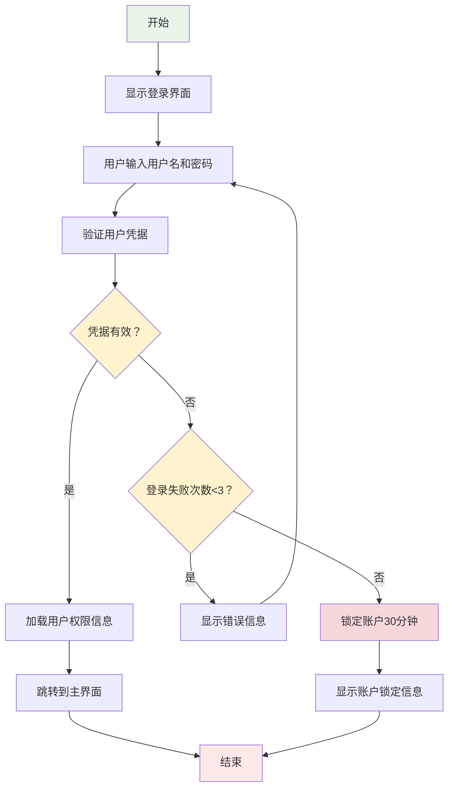
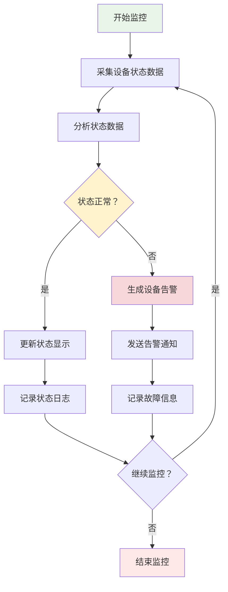

# 智慧城市综合交通管理与服务平台需求规约说明书

**智慧城市科技有限公司编制**  
**二O二五年十月**

## 版本历史

| 日期 | 版本 | 说明 | 作者 |
|------|------|------|------|
| 2025-10-24 | V1.0 | 初始版本 | 系统架构师 |
| 2025-10-25 | V1.1 | 需求完善 | 业务分析师 |

**注：本模板的版权归何滨所有。所有人都可以直接使用，而无需支付任何费用。但不得删除本条说明。**

---

## 目录

**一、引言** .................................................... 1  
1.1 编写目的 .................................................. 1  
1.2 背景 ...................................................... 1  
1.3 定义 ...................................................... 1  
1.4 参考资料 .................................................. 1  

**二、任务概述** .............................................. 1  
2.1 目标 ...................................................... 1  
2.2 用户画像 .................................................. 2  
2.3 假定和约束 ................................................ 2  

**三、需求规定** .............................................. 2  
3.1 功能性需求 ................................................ 2  
3.1.1 用例模型主图 ............................................ 2  
3.1.2 用例说明 ................................................ 3  
3.2 非功能性需求 .............................................. 5  
3.2.1 精度（可选） ............................................ 5  
3.2.2 时间特性要求 ............................................ 5  
3.2.3 性能 .................................................... 5  
3.2.4 可靠性 .................................................. 6  
3.2.5 故障处理要求 ............................................ 6  
3.2.6 安全 .................................................... 6  
3.2.7 设计约束 ................................................ 6  
3.2.8 UI设计要求（可选） ...................................... 6  
3.3 人工操作描述（可选） ...................................... 6  

**四、运行环境规定** .......................................... 6  
4.1 硬件设备 .................................................. 6  
4.2 支持软件 .................................................. 7  
4.3 接口 ...................................................... 7  

**五、词汇表** ................................................ 7  

**六、参考文献** .............................................. 7  

---

## 一、引言

### 1.1 编写目的

本文档旨在全面描述智慧城市综合交通管理与服务平台的软件需求规格说明，为系统设计、开发、测试和验收提供详细的技术依据。本文档详细阐述了系统的功能需求、性能需求、接口需求、约束条件等各项技术规格要求。

**预期读者包括：**
- 项目开发团队成员（系统架构师、开发工程师、测试工程师）
- 项目管理人员和产品经理
- 客户方技术人员和业务专家
- 系统运维和技术支持人员
- 质量保证和文档管理人员

### 1.2 背景

**待开发的软件系统名称：** 智慧城市综合交通管理与服务平台

**本项目的任务提出者：** 市政府智慧城市建设领导小组办公室  
**开发者：** 智慧城市科技有限公司  
**用户：** 交通管理部门工作人员、交通执法人员、市民用户、系统运维人员、决策管理层  
**实现该软件的计算中心：** 市政务云计算中心

本软件系统与城市交通信号控制系统、公安交通管理综合应用平台、城市应急指挥系统、智慧停车管理系统、公共交通调度系统等外部系统建立数据交互和业务协同关系，构建完整的智慧交通生态体系。

### 1.3 定义

**智慧交通：** 运用物联网、云计算、大数据、人工智能等新一代信息技术，实现交通系统在更大的时空范围内具备感知、互联、分析、预测、控制等能力，以充分保障交通安全、发挥交通基础设施效能、提升交通系统运行效率和管理水平。

**交通大数据：** 通过各种交通感知设备采集的海量、多源、异构的交通相关数据，包括交通流量数据、车辆轨迹数据、交通事件数据、路况信息数据等。

**微服务架构：** 一种将单一应用程序开发为一组小型服务的方法，每个服务运行在自己的进程中，并使用轻量级机制（通常是HTTP资源API）进行通信。

**API网关：** 作为系统对外的唯一入口，封装内部系统架构，为每个客户端提供定制化的API，并提供协议转换、安全认证、流量控制、监控统计等功能。

**RBAC：** 基于角色的访问控制（Role-Based Access Control），通过角色来管理权限，用户通过成为适当角色的成员而得到这些角色的权限。

**容器化部署：** 使用容器技术将应用程序及其依赖项打包在一起，实现快速部署、弹性扩展和环境一致性。

### 1.4 参考资料

1. 《智慧城市建设技术规范》（GB/T 34678-2017），国家标准化管理委员会，2017年8月发布
2. 《城市道路交通管理系统技术要求》（GA/T 1049-2013），公安部交通管理科学研究所，2013年12月发布
3. 《软件工程 软件需求规格说明》（GB/T 9385-2008），全国信息技术标准化技术委员会，2008年6月发布
4. 《信息安全技术 网络安全等级保护基本要求》（GB/T 22239-2019），全国信息安全标准化技术委员会，2019年5月发布
5. 《智慧城市综合交通管理系统建设方案》，市政府智慧城市建设领导小组办公室，2025年3月
6. 《城市交通数据标准规范》（JT/T 719-2008），交通运输部，2008年10月发布

---

## 二、任务概述

### 2.1 目标

本项目旨在构建一个面向智慧城市的综合交通管理与服务平台，通过先进的信息技术手段，实现城市交通管理的数字化、智能化和精细化，全面提升城市交通管理效率和公共服务水平。

**软件开发的意图：**
建设一个集交通数据采集、处理、分析、应用于一体的综合性交通管理平台，为交通管理部门提供科学决策支持，为市民提供便民交通服务，为城市交通治理提供技术支撑。

**应用目标：**
- 实现交通数据的统一采集、存储、处理和分析
- 建立智能化的交通设备监控和管理体系
- 构建多渠道的交通信息发布和服务平台
- 建立高效的交通服务工单处理和跟踪机制
- 实现交通违法处理和费用管理的电子化
- 建立完善的系统运维监控和日志管理体系

**作用范围：**
本系统覆盖城市交通管理的全业务流程，包括交通流量监测、信号控制优化、交通事件处理、违章执法管理、停车服务管理、公共交通调度、交通信息发布、市民服务受理等核心业务领域。

本软件产品是智慧城市建设的重要组成部分，与城市大脑、政务服务平台、应急指挥系统等形成有机整体。系统组成和接口关系如下图所示：
```merm
aid
graph TB
    subgraph "智慧城市综合交通管理与服务平台"
        A1[用户管理模块]
        A2[交通数据管理模块]
        A3[交通设备管理模块]
        A4[交通信息发布模块]
        A5[工单管理模块]
        A6[支付管理模块]
        A7[系统日志模块]
        A8[报表统计模块]
        A9[系统配置模块]
        A10[系统监控模块]
    end
    
    subgraph "外部系统"
        B1[城市交通信号控制系统]
        B2[公安交管综合应用平台]
        B3[城市应急指挥系统]
        B4[智慧停车管理系统]
        B5[公共交通调度系统]
        B6[城市大脑平台]
    end
    
    A2 --> B1
    A2 --> B2
    A3 --> B1
    A4 --> B3
    A5 --> B2
    A6 --> B4
    A8 --> B6
    
    style A1 fill:#e3f2fd
    style A2 fill:#e3f2fd
    style A3 fill:#e3f2fd
    style A4 fill:#e3f2fd
    style A5 fill:#e3f2fd
    style A6 fill:#e3f2fd
    style A7 fill:#e3f2fd
    style A8 fill:#e3f2fd
    style A9 fill:#e3f2fd
    style A10 fill:#e3f2fd
    style B1 fill:#fff3e0
    style B2 fill:#fff3e0
    style B3 fill:#fff3e0
    style B4 fill:#fff3e0
    style B5 fill:#fff3e0
    style B6 fill:#fff3e0
```

### 2.2 用户画像

**交通管理人员：**
- 教育水平：大专及以上学历，交通工程、交通管理或相关专业背景
- 技术专长：熟悉交通管理业务流程，具备基本的计算机操作技能和数据分析能力
- 预期使用频度：每日8小时持续使用，属于系统的核心用户群体
- 主要使用功能：交通数据管理、设备监控、信息发布、工单处理、报表查看

**交通执法人员：**
- 教育水平：高中及以上学历，具备交通法规和执法程序的专业知识
- 技术专长：熟悉移动执法设备操作，具备现场执法和证据采集能力
- 预期使用频度：工作时间内频繁使用，主要通过移动端访问
- 主要使用功能：违章处理、现场执法、工单提交、信息查询

**系统运维人员：**
- 教育水平：本科及以上学历，计算机科学、软件工程或相关专业背景
- 技术专长：精通系统运维、数据库管理、网络安全、故障诊断等技术
- 预期使用频度：7×24小时监控，应急响应时集中使用
- 主要使用功能：系统监控、日志管理、配置管理、性能优化

**市民用户：**
- 教育水平：初中及以上学历，具备基本的智能手机和网络使用能力
- 技术专长：熟悉移动应用操作，无需专业技术背景
- 预期使用频度：按需使用，主要用于查询交通信息和办理相关业务
- 主要使用功能：交通信息查询、违章查询、费用缴纳、服务申请

**决策管理层：**
- 教育水平：本科及以上学历，具备管理学、公共管理或相关专业背景
- 技术专长：关注数据分析和决策支持功能，具备基本的数据解读能力
- 预期使用频度：定期查看统计报表和分析数据，用于决策支持
- 主要使用功能：数据报表、趋势分析、决策支持、绩效评估

### 2.3 假定和约束

**技术假定和约束：**
- 系统必须支持7×24小时不间断运行，年度可用性不低于99.5%
- 系统响应时间：普通查询不超过3秒，复杂报表生成不超过30秒
- 系统并发处理能力：支持不少于10000个并发用户同时在线
- 数据存储容量：支持至少5年的历史数据存储和快速检索
- 系统扩展性：支持水平扩展，能够根据业务增长进行弹性扩容

**安全约束：**
- 系统必须符合国家网络安全等级保护三级要求
- 用户敏感数据必须进行加密存储，传输过程采用HTTPS/TLS加密
- 系统必须具备完整的用户操作审计日志功能
- 必须建立完善的数据备份和灾难恢复机制

**业务约束：**
- 系统必须与现有交通管理系统保持数据和业务的兼容性
- 数据接口必须符合国家和行业相关标准规范
- 系统界面和操作流程必须符合政务系统的设计规范
- 必须支持多种终端设备访问（PC、平板、手机）

**项目约束：**
- 项目开发周期：12个月（包括需求分析、系统设计、开发实施、测试部署）
- 项目预算限制：总投资控制在500万元人民币以内
- 开发团队规模：核心开发团队不超过20人
- 部署环境：必须在政务云环境中部署，符合政务云安全要求

---

## 三、需求规定

### 3.1 功能性需求

#### 3.1.1 用例模型主图

（注意：一个系统通常只有一张用例模型主图，要求使用ROSE软件绘制用例图和活动图）

**图1：智慧城市综合交通管理与服务平台系统用例模型图**

```mermaid
graph LR
    %% 定义参与者
    TM[交通管理员]
    TE[交通执法人员]
    SM[系统运维员]
    CU[市民用户]
    DM[决策管理层]
    ES[外部系统]
    
    %% 定义用例组
    subgraph "用户管理"
        UM1[用户注册]
        UM2[用户登录]
        UM3[权限管理]
        UM4[角色分配]
    end
    
    subgraph "数据管理"
        DM1[数据录入]
        DM2[数据查询]
        DM3[数据分析]
        DM4[数据导入导出]
    end
    
    subgraph "设备管理"
        DevM1[设备注册]
        DevM2[设备监控]
        DevM3[故障处理]
        DevM4[维护管理]
    end
    
    subgraph "信息发布"
        IM1[内容编辑]
        IM2[信息审核]
        IM3[多渠道发布]
        IM4[效果统计]
    end
    
    subgraph "工单管理"
        TM1[工单创建]
        TM2[工单分派]
        TM3[工单处理]
        TM4[工单跟踪]
    end
    
    subgraph "支付管理"
        PM1[费用计算]
        PM2[在线支付]
        PM3[退款处理]
        PM4[财务对账]
    end
    
    subgraph "系统管理"
        SM1[系统监控]
        SM2[日志管理]
        SM3[配置管理]
        SM4[报表生成]
    end
    
    %% 参与者与用例的关系
    TM --> UM3
    TM --> UM4
    TM --> DM1
    TM --> DM2
    TM --> DM3
    TM --> DevM1
    TM --> DevM2
    TM --> IM1
    TM --> IM2
    TM --> TM2
    TM --> TM3
    TM --> SM4
    
    TE --> UM2
    TE --> DM1
    TE --> TM1
    TE --> PM1
    
    SM --> SM1
    SM --> SM2
    SM --> SM3
    SM --> DevM3
    SM --> DevM4
    
    CU --> UM1
    CU --> UM2
    CU --> DM2
    CU --> TM1
    CU --> PM2
    
    DM --> SM4
    DM --> DM3
    
    ES --> DM4
    ES --> DevM2
    
    %% 样式定义
    classDef actor fill:#e3f2fd,stroke:#1976d2,stroke-width:2px
    classDef usecase fill:#f1f8e9,stroke:#388e3c,stroke-width:2px
    
    class TM,TE,SM,CU,DM,ES actor
```



#### 3.1.2 用例说明

对上图每个用例按如下内容模板编写：

**用例：用户登录**

- **简单描述**  
  This use case describes how a user logs into the Smart Traffic Management System, including authentication and authorization processes.

- **事件流程**  
  1. **基本流程**  
     This use case starts when the actor wishes to log into the Smart Traffic Management System.
     1) The system requests that the actor enter his/her username and password
     2) The actor enters his/her username and password
     3) The system validates the entered username and password against the user database
     4) The system loads the user's role and permission information
     5) The system logs the actor into the system and redirects to the main dashboard

  2. **可选流程**  
     1) **Invalid Username/Password**  
        If, in the Basic Flow, the actor enters an invalid username and/or password, the system displays an error message. The actor can choose to either return to the beginning of the Basic Flow or cancel the login, at which point the use case ends.
     
     2) **Account Locked**  
        If the user account is locked due to multiple failed login attempts, the system displays a lock notification and prevents login until the lockout period expires or an administrator unlocks the account.
     
     3) **First Time Login**  
        If this is the user's first login, the system forces the user to change their default password before proceeding to the main system.

- **特殊需求**  
  - Password must be transmitted using HTTPS encryption
  - Account lockout after 3 consecutive failed attempts for 30 minutes
  - Session timeout after 2 hours of inactivity
  - Support for multi-factor authentication for administrative users

- **前置条件**  
  The user must have a valid account registered in the system.

- **后置条件**  
  If the use case was successful, the actor is now logged into the system with appropriate permissions loaded. If not, the system state is unchanged.

- **扩展点**  
  None.

**用例：交通数据录入**

- **简单描述**  
  This use case describes how traffic management personnel input various types of traffic data into the system, including traffic flow data, vehicle information, and road condition data.

- **事件流程**  
  1. **基本流程**  
     This use case starts when a traffic manager needs to input traffic data.
     1) The system displays the data input interface with available data categories
     2) The actor selects the type of data to input (traffic flow, vehicle info, road conditions, etc.)
     3) The system presents the appropriate input form with required fields
     4) The actor fills in the data fields with relevant information
     5) The system validates the data format, completeness, and business rules
     6) The system saves the data to the database and provides confirmation

  2. **可选流程**  
     1) **Batch Data Import**  
        The actor can choose to upload Excel or CSV files for batch data import instead of manual entry.
     
     2) **Data Validation Failure**  
        If the data fails validation checks, the system displays specific error messages and highlights problematic fields.
     
     3) **Duplicate Data Detection**  
        If the system detects potential duplicate data, it prompts the user to confirm or modify the entry.

- **特殊需求**  
  - Support for Excel and CSV file formats for batch import
  - Automatic data backup after successful entry
  - Data entry templates available for download
  - Real-time data validation with immediate feedback

- **前置条件**  
  The user must be logged in with data entry permissions.

- **后置条件**  
  The data is successfully stored in the database and available for queries and analysis.

**用例：设备状态监控**

- **简单描述**  
  This use case describes how the system continuously monitors traffic equipment status and handles equipment failures or anomalies.

- **事件流程**  
  1. **基本流程**  
     This use case runs continuously as a background process.
     1) The system automatically collects status data from connected traffic equipment
     2) The system analyzes the status data against predefined normal parameters
     3) The system updates the equipment status display in real-time
     4) The system logs all status changes for historical tracking

  2. **可选流程**  
     1) **Equipment Failure Detection**  
        If abnormal status is detected, the system generates an alert and notifies relevant personnel.
     
     2) **Maintenance Mode**  
        Equipment can be manually set to maintenance mode, suspending normal monitoring alerts.

- **特殊需求**  
  - Real-time status updates with maximum 30-second delay
  - Automatic alert generation for critical failures
  - Historical status data retention for at least 2 years
  - Support for various equipment communication protocols

- **前置条件**  
  Equipment must be properly registered and connected to the system.

- **后置条件**  
  Equipment status is accurately reflected in the system and any anomalies are properly logged and reported.

整个文档中至少2张活动图：

**图2：用户登录用例的活动图**



**图3：交通设备监控用例的活动图**



### 3.2 非功能性需求

#### 3.2.1 精度（可选）

**数据精度要求：**
- 交通流量数据精度：车辆计数误差不超过±2%，速度测量误差不超过±5%
- 时间戳精度：所有时间数据精确到秒级，系统时间同步误差不超过1秒
- 地理位置精度：GPS坐标定位精度不低于10米，重要路口精度不低于5米
- 财务数据精度：金额计算精确到分，汇率换算保留4位小数
- 统计分析精度：百分比数据保留2位小数，大数据统计误差不超过0.1%

**传输过程精度要求：**
- 数据传输过程中不得出现数据丢失或损坏
- 文件传输完整性校验，确保传输前后数据一致
- 实时数据传输延迟不超过500毫秒

#### 3.2.2 时间特性要求

**响应时间要求：**
- 用户登录响应时间：不超过2秒
- 普通数据查询响应时间：不超过3秒
- 复杂统计查询响应时间：不超过10秒
- 报表生成时间：简单报表不超过10秒，复杂报表不超过30秒
- 设备状态更新间隔：不超过30秒
- 告警通知响应时间：不超过1分钟

**更新处理时间：**
- 数据录入确认时间：不超过2秒
- 批量数据导入：10000条记录不超过5分钟
- 系统配置更新生效时间：不超过30秒
- 用户权限变更生效时间：不超过1分钟

**数据转换和传送时间：**
- 数据格式转换时间：不超过处理时间的10%
- 文件上传时间：100MB文件不超过5分钟
- 数据备份时间：每日增量备份不超过2小时
- 数据同步时间：与外部系统数据同步不超过10分钟

#### 3.2.3 性能

**同时在线数量：**
- 系统支持同时在线用户数：不少于10000人
- 峰值并发用户数：不少于15000人
- 数据库并发连接数：不少于1000个
- API接口并发请求数：不少于5000次/分钟

**吞吐量要求：**
- 数据录入处理能力：不少于1000条/分钟
- 查询处理能力：不少于10000次/小时
- 报表生成能力：不少于100个报表/小时
- 文件处理能力：支持100MB以内文件的快速处理

**存储性能：**
- 数据库读写性能：读操作不少于10000次/秒，写操作不少于5000次/秒
- 文件存储性能：支持1GB/秒的数据吞吐量
- 缓存命中率：不低于85%

#### 3.2.4 可靠性

The system shall be available 24 hours a day 7 days a week, with no more than 10% down time.

**系统可用性要求：**
- 年度系统可用性：不低于99.5%（年度停机时间不超过43.8小时）
- 月度计划外停机时间：不超过4小时
- 单次故障恢复时间：不超过30分钟
- 数据备份成功率：不低于99.9%

**容错能力：**
- 支持单点故障自动切换
- 数据库主从热备，自动故障转移
- 关键业务模块支持降级服务
- 网络中断后自动重连机制

#### 3.2.5 故障处理要求

**软件故障处理：**
- 应用程序异常：自动重启服务，记录详细错误日志
- 数据库连接失败：自动重连机制，最多重试5次
- 第三方接口故障：启用降级处理，提供备用方案
- 内存溢出：自动垃圾回收，必要时重启相关服务

**硬件故障处理：**
- 服务器硬件故障：自动切换到备用服务器，故障转移时间不超过5分钟
- 网络设备故障：启用冗余网络链路，自动路由切换
- 存储设备故障：通过RAID技术和数据备份保证数据安全
- 电源故障：UPS供电保障，支持至少30分钟的应急供电

**故障恢复要求：**
- 建立完善的故障预警机制
- 提供7×24小时技术支持服务
- 故障处理流程标准化，响应时间不超过15分钟
- 定期进行故障演练和恢复测试

#### 3.2.6 安全

**用户权限管理：**
- 实施基于角色的访问控制（RBAC），支持细粒度权限管理
- 用户密码强度要求：至少8位，包含大小写字母、数字和特殊字符
- 支持多级权限管理和权限继承机制
- 提供完整的用户操作审计日志，记录所有敏感操作

**系统安全约定：**
- 符合国家网络安全等级保护三级要求
- 部署Web应用防火墙（WAF），防护SQL注入、XSS等攻击
- 实施入侵检测系统（IDS），实时监控安全威胁
- 定期进行安全漏洞扫描和渗透测试

**数据安全：**
- 敏感数据采用AES-256加密算法进行存储
- 数据传输采用HTTPS/TLS 1.3加密协议
- 数据库访问采用白名单机制，限制访问来源
- 建立数据分级分类管理制度，核心数据加密存储

#### 3.2.7 设计约束

**技术架构约束：**
- 后端开发语言：Java 11或以上版本，Spring Boot框架
- 前端开发框架：Vue.js 3.x或React 18.x，支持响应式设计
- 数据库系统：MySQL 8.0或PostgreSQL 13，支持主从复制
- 消息队列：Apache Kafka 2.8或RabbitMQ 3.8
- 缓存系统：Redis 6.0或以上版本，支持集群模式

**接口集成约束：**
- 必须集成微信支付和支付宝支付接口，支持扫码支付和APP支付
- 必须对接公安交管平台数据接口，遵循GA/T标准规范
- 必须支持短信和邮件通知接口，支持模板化消息发送
- 必须符合政务服务平台接口规范，支持统一身份认证

**部署环境约束：**
- 必须在政务云环境中部署，符合政务云安全规范
- 支持容器化部署，使用Docker和Kubernetes
- 支持微服务架构，各服务模块独立部署和扩展
- 支持灰度发布和蓝绿部署策略

#### 3.2.8 UI设计要求（可选）

**界面设计原则：**
- 采用响应式设计，支持PC端、平板和移动端的自适应显示
- 界面风格简洁明了，符合政务系统UI设计规范
- 支持主题切换功能，提供明亮和暗黑两种主题
- 支持字体大小调节，满足不同用户的视觉需求
- 提供无障碍访问支持，符合WCAG 2.1 AA级标准

**用户体验要求：**
- 核心业务操作流程不超过3个步骤
- 重要操作提供二次确认提示，防止误操作
- 错误信息清晰明确，提供具体的解决建议
- 支持键盘快捷键操作，提高操作效率
- 提供操作指南和帮助文档，支持在线帮助

**界面布局要求：**
- 主导航清晰明确，支持面包屑导航
- 数据表格支持排序、筛选、分页功能
- 表单设计简洁，必填项明确标识
- 图表展示直观，支持交互式操作
- 移动端界面优化，支持触摸操作

### 3.3 人工操作描述（可选）

**数据录入人工操作：**
- 交通管理员需要定期录入交通流量数据，包括车流量、平均速度、拥堵指数等
- 执法人员需要现场录入违章信息，包括违章类型、时间地点、证据材料等
- 设备维护人员需要录入设备检修记录，包括维护内容、更换部件、测试结果等

**数据审核人工操作：**
- 数据管理员需要对录入的数据进行质量检查，确保数据的准确性和完整性
- 业务主管需要对重要数据变更进行审核确认
- 系统管理员需要对用户权限变更进行审核批准

**应急处理人工操作：**
- 当系统出现故障时，运维人员需要手动切换到备用系统
- 当发生交通事故时，调度员需要手动调整信号灯配时
- 当出现网络中断时，现场人员需要通过备用通信方式上报信息

---

## 四、运行环境规定

### 4.1 硬件设备

**服务器硬件配置：**

**应用服务器集群：**
- 处理器：Intel Xeon Gold 6248R 或同等性能，24核心3.0GHz，支持超线程技术
- 内存：128GB DDR4-2933 ECC内存，支持内存热插拔
- 存储：2TB NVMe SSD + 4TB SATA SSD，支持RAID 1+0配置
- 网络：双万兆以太网接口，支持网络冗余
- 数量：不少于4台，支持负载均衡和故障转移

**数据库服务器集群：**
- 处理器：Intel Xeon Platinum 8280 或同等性能，28核心2.7GHz
- 内存：256GB DDR4-2933 ECC内存，支持内存镜像
- 存储：4TB NVMe SSD，支持RAID 10配置，IOPS不低于100000
- 网络：双万兆以太网接口 + 专用存储网络接口
- 数量：不少于3台（1主2从），支持自动故障转移

**负载均衡设备：**
- 吞吐量：不少于20Gbps
- 并发连接数：不少于200万
- 新建连接数：不少于50万/秒
- 支持SSL卸载、健康检查、会话保持功能
- 支持双机热备，故障切换时间不超过3秒

**存储设备：**
- 存储容量：不少于100TB可用容量
- 存储类型：全闪存阵列，支持SSD和NVMe混合配置
- IOPS性能：不低于500000 IOPS
- 带宽：不低于10GB/s
- 支持快照、复制、重删压缩等高级功能

**网络设备：**
- 核心交换机：万兆端口不少于48个，支持40G/100G上联
- 接入交换机：千兆端口不少于48个，万兆上联端口不少于4个
- 防火墙：吞吐量不少于10Gbps，支持深度包检测
- 路由器：支持BGP、OSPF等路由协议，冗余配置

**终端设备：**
- 管理终端：Intel i7处理器，16GB内存，512GB SSD，27寸4K显示器
- 移动执法终端：支持4G/5G网络，GPS定位，高清摄像头
- 大屏显示设备：LED显示屏，分辨率不低于1920×1080，支持7×24小时连续显示

### 4.2 支持软件

**操作系统：**
- 服务器操作系统：CentOS 8.4 或 Ubuntu Server 20.04 LTS 或 Red Hat Enterprise Linux 8
- 容器平台：Docker 20.10 或以上版本，支持容器编排
- 容器编排：Kubernetes 1.21 或以上版本，支持自动扩缩容
- 虚拟化平台：VMware vSphere 7.0 或 OpenStack Victoria

**数据库软件：**
- 关系型数据库：MySQL 8.0.25 或 PostgreSQL 13.3，支持主从复制和读写分离
- 缓存数据库：Redis 6.2 或以上版本，支持集群模式和持久化
- 搜索引擎：Elasticsearch 7.13 或以上版本，支持全文检索和日志分析
- 时序数据库：InfluxDB 2.0，用于存储设备监控数据

**中间件软件：**
- Web服务器：Nginx 1.20 或 Apache HTTP Server 2.4，支持负载均衡和SSL终结
- 应用服务器：Apache Tomcat 9.0 或 Spring Boot 内嵌Jetty服务器
- 消息队列：Apache Kafka 2.8 或 RabbitMQ 3.8，支持高可用集群
- API网关：Kong 2.4 或 Zuul 2.0，支持限流、认证、监控

**开发和测试工具：**
- 版本控制：Git 2.30 或以上版本，GitLab CE 13.12
- 持续集成：Jenkins 2.289 或 GitLab CI/CD
- 代码质量：SonarQube 8.9，支持代码扫描和质量门禁
- 性能测试：JMeter 5.4，LoadRunner 2021

**监控和运维软件：**
- 系统监控：Prometheus 2.27 + Grafana 8.0，支持自定义监控指标
- 日志管理：ELK Stack（Elasticsearch + Logstash + Kibana）7.13
- APM监控：Skywalking 8.6 或 Pinpoint 2.3
- 配置管理：Ansible 4.2 或 Puppet 7.0

**浏览器支持：**
- Google Chrome 91 或以上版本（推荐）
- Mozilla Firefox 89 或以上版本
- Microsoft Edge 91 或以上版本
- Safari 14.1 或以上版本（macOS）
- 不支持Internet Explorer

**移动设备操作系统：**
- iOS 14.0 或以上版本，支持iPhone和iPad
- Android 9.0 (API Level 28) 或以上版本
- HarmonyOS 2.0 或以上版本

### 4.3 接口

**外部系统接口：**

**公安交管平台接口：**
- 协议类型：Web Service (SOAP 1.2) 和 RESTful API
- 数据格式：XML和JSON
- 认证方式：数字证书 + API密钥
- 接口功能：违章数据同步、车辆信息查询、驾驶员信息验证
- 调用频率：不超过1000次/分钟
- 超时设置：30秒

**支付平台接口：**
- 微信支付：支持JSAPI、Native、APP、H5支付方式
- 支付宝支付：支持当面付、手机网站支付、APP支付
- 银联支付：支持网关支付和快捷支付
- 数据加密：RSA 2048位加密
- 回调机制：支持异步通知和同步返回

**短信和邮件接口：**
- 短信平台：支持阿里云短信、腾讯云短信、华为云短信
- 邮件服务：支持SMTP协议，SSL/TLS加密
- 模板管理：支持短信和邮件模板配置
- 发送频率：短信不超过100条/分钟，邮件不超过500封/分钟

**地图服务接口：**
- 百度地图API：支持地理编码、路径规划、实时路况
- 高德地图API：支持POI搜索、距离计算、地图展示
- 腾讯地图API：支持位置服务、导航服务
- 调用限制：每日不超过100万次

**数据通信协议：**

**HTTP/HTTPS协议：**
- 版本：HTTP/1.1 和 HTTP/2
- 加密：TLS 1.3，支持完美前向保密
- 压缩：支持Gzip和Brotli压缩
- 缓存：支持ETag和Last-Modified缓存策略

**WebSocket协议：**
- 版本：RFC 6455标准
- 用途：实时数据推送、双向通信
- 心跳机制：30秒间隔心跳包
- 重连机制：断线自动重连，最多重试5次

**MQTT协议：**
- 版本：MQTT 3.1.1 或 5.0
- 用途：物联网设备数据采集
- QoS级别：支持0、1、2三个级别
- 保活时间：60秒

**TCP/UDP协议：**
- TCP：用于可靠数据传输，支持长连接
- UDP：用于实时数据传输，如视频流
- 端口管理：使用标准端口和自定义端口
- 防火墙：配置端口白名单

**数据格式标准：**

**JSON格式：**
- 标准：RFC 7159
- 编码：UTF-8
- 数据类型：支持字符串、数字、布尔、数组、对象、null
- 日期格式：ISO 8601标准（YYYY-MM-DDTHH:mm:ss.sssZ）

**XML格式：**
- 标准：XML 1.0
- 编码：UTF-8
- 命名空间：支持XML命名空间
- 验证：支持XSD模式验证

**CSV格式：**
- 标准：RFC 4180
- 编码：UTF-8 with BOM
- 分隔符：逗号（,）
- 转义：双引号转义

**PDF格式：**
- 版本：PDF 1.7 (ISO 32000-1)
- 字体：支持中文字体嵌入
- 安全：支持密码保护和数字签名
- 压缩：支持图像和文本压缩

---

## 五、词汇表

| 术语 | 英文全称 | 定义 |
|------|----------|------|
| 智慧交通 | Intelligent Transportation System (ITS) | 运用先进的信息技术、数据通讯传输技术、电子传感技术、控制技术及计算机技术等有效地集成运用于整个地面交通管理系统，建立在大范围内、全方位发挥作用的实时、准确、高效的综合交通运输管理系统 |
| 微服务架构 | Microservices Architecture | 一种将单一应用程序开发为一组小型服务的方法，每个服务运行在自己的进程中，并使用轻量级机制（通常是HTTP资源API）进行通信 |
| API网关 | API Gateway | 作为系统对外的唯一入口，封装内部系统架构，为每个客户端提供定制化的API，并提供协议转换、安全认证、流量控制、监控统计等功能 |
| RBAC | Role-Based Access Control | 基于角色的访问控制，通过角色来管理权限，用户通过成为适当角色的成员而得到这些角色的权限，实现了用户与权限的逻辑分离 |
| 负载均衡 | Load Balancing | 在多个计算资源（如计算机、计算机集群、网络链路、中央处理单元或磁盘驱动器）之间分配工作负载，以优化资源使用、最大化吞吐量、最小化响应时间并避免过载 |
| 容器化部署 | Containerized Deployment | 使用容器技术将应用程序及其依赖项打包在一起，实现快速部署、弹性扩展和环境一致性的部署方式 |
| 分布式系统 | Distributed System | 由多个独立的计算机组成，通过网络连接，协同工作完成共同任务的系统，对用户来说就像是一个单一的系统 |
| 数据中台 | Data Middle Platform | 企业数据管理和服务的统一平台，提供数据采集、存储、计算、服务等能力，支持数据的统一管理和共享应用 |
| 交通大数据 | Traffic Big Data | 通过各种交通感知设备采集的海量、多源、异构的交通相关数据，具有数据量大、类型多样、处理速度快、价值密度低的特征 |
| 物联网 | Internet of Things (IoT) | 通过信息传感设备，按约定的协议，将任何物体与网络相连接，物体通过信息传播媒介进行信息交换和通信，以实现智能化识别、定位、跟踪、监管等功能 |
| 云计算 | Cloud Computing | 一种按使用量付费的模式，这种模式提供可用的、便捷的、按需的网络访问，进入可配置的计算资源共享池，这些资源能够被快速提供，只需投入很少的管理工作 |
| 人工智能 | Artificial Intelligence (AI) | 研究、开发用于模拟、延伸和扩展人的智能的理论、方法、技术及应用系统的一门新的技术科学 |
| 区块链 | Blockchain | 一种按照时间顺序将数据区块以顺序相连的方式组合成的一种链式数据结构，并以密码学方式保证的不可篡改和不可伪造的分布式账本 |
| 边缘计算 | Edge Computing | 在靠近物或数据源头的一侧，采用网络、计算、存储、应用核心能力为一体的开放平台，就近提供最近端服务 |
| 数字孪生 | Digital Twin | 充分利用物理模型、传感器更新、运行历史等数据，集成多学科、多物理量、多尺度、多概率的仿真过程，在虚拟空间中完成映射，从而反映相对应的实体装备的全生命周期过程 |

---

## 六、参考文献

1. 国家标准化管理委员会. 《智慧城市建设技术规范》(GB/T 34678-2017). 中国标准出版社, 2017年8月.

2. 公安部交通管理科学研究所. 《城市道路交通管理系统技术要求》(GA/T 1049-2013). 公安部, 2013年12月.

3. 全国信息技术标准化技术委员会. 《软件工程 软件需求规格说明》(GB/T 9385-2008). 中国标准出版社, 2008年6月.

4. 全国信息安全标准化技术委员会. 《信息安全技术 网络安全等级保护基本要求》(GB/T 22239-2019). 中国标准出版社, 2019年5月.

5. 交通运输部. 《城市交通数据标准规范》(JT/T 719-2008). 人民交通出版社, 2008年10月.

6. 住房和城乡建设部. 《智慧城市评价模型及基础评价指标体系》(GB/T 33356-2016). 中国标准出版社, 2016年12月.

7. 市政府智慧城市建设领导小组办公室. 《智慧城市综合交通管理系统建设方案》. 内部文件, 2025年3月.

8. Martin Fowler, James Lewis. 《微服务架构设计模式》. 机械工业出版社, 2019年6月.

9. 阿里巴巴集团技术团队. 《大型网站系统与Java中间件实践》. 电子工业出版社, 2020年3月.

10. Chris Richardson. 《微服务架构设计》. 人民邮电出版社, 2018年8月.

11. 腾讯云技术团队. 《云原生架构实践》. 电子工业出版社, 2021年5月.

12. IEEE Computer Society. 《IEEE Std 830-1998 - IEEE Recommended Practice for Software Requirements Specifications》. IEEE, 1998.

---

**文档编制完成日期：** 2025年10月24日  
**文档审核人员：** 项目经理、技术总监、质量经理  
**文档审核状态：** 待审核  
**下一版本计划：** 根据评审意见进行修订，预计2025年11月发布V1.2版本  
**文档存档位置：** 项目文档管理系统 /docs/requirements/  
**文档密级：** 内部文件