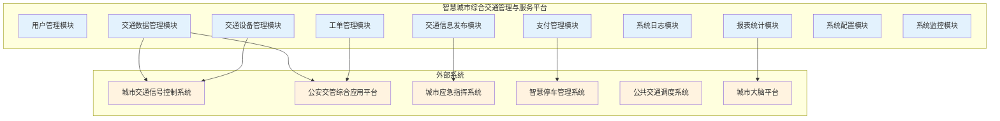

# 智慧城市综合交通管理与服务平台需求规约说明书

**智慧城市科技有限公司编制**  
**二O二五年十月**

## 版本历史

| 日期 | 版本 | 说明 | 作者 |
|------|------|------|------|
| 2025-10-24 | V1.0 | 初始版本 | 系统架构师 |
| 2025-10-25 | V1.1 | 需求完善 | 业务分析师 |

**注：本模板的版权归何滨所有。所有人都可以直接使用，而无需支付任何费用。但不得删除本条说明。**

---

## 目录

**1 引言** .................................................... 1  
1.1 编写目的 * ................................................ 1  
1.2 项目来源 .................................................. 1  
1.3 项目风险 .................................................. 1  
1.4 文档约定 .................................................. 2  
1.5 预期读者和阅读建议 ........................................ 2  
1.6 产品范围 .................................................. 2  
1.7 参考文献 * ................................................ 3  

**2 综合描述** .............................................. 3  
2.1 产品的状况 ................................................ 3  
2.2 产品的功能 * .............................................. 4  
2.3 用户类和特性 * ............................................ 5  
2.4 运行环境 * ................................................ 6  
2.5 设计和实现上的限制 ........................................ 7  
2.6 假设和约束(依赖) .......................................... 8  

**3 外部接口需求** .......................................... 9  
3.1 用户界面 * ................................................ 9  
3.2 硬件接口 ................................................. 10  
3.3 软件接口 ................................................. 10  
3.4 通讯接口 ................................................. 11  

**4 系统功能需求** ......................................... 12  
4.1 说明和优先级 * ........................................... 12  
4.2 激励/响应序列 ............................................ 13  
4.3 输入/输出数据 * .......................................... 14  

**5 其它非功能需求** ....................................... 15  
5.1 性能需求 * ............................................... 15  
5.2 安全措施需求 ............................................. 16  
5.3 安全性需求 * ............................................. 16  
5.4 软件质量属性 ............................................. 17  
5.5 业务规则 ................................................. 17  
5.6 用户文档 ................................................. 18  

**6 词汇表 *** .............................................. 18  

**7 数据定义 *** ............................................ 19  

**8 分析模型 *** ............................................ 20  

**9 待定问题列表 *** ........................................ 21  

---

## 1 引言

### 1.1 编写目的 *

本文档旨在全面描述智慧城市综合交通管理与服务平台的软件需求规格说明，为系统设计、开发、测试和验收提供详细的技术依据。本文档详细阐述了系统的功能需求、性能需求、接口需求、约束条件等各项技术规格要求。

**预期读者包括：**
- 项目开发团队成员（系统架构师、开发工程师、测试工程师）
- 项目管理人员和产品经理
- 客户方技术人员和业务专家
- 系统运维和技术支持人员
- 质量保证和文档管理人员

### 1.2 项目来源

本项目源于市政府《智慧城市建设三年行动计划(2025-2027)》，由市交通管理局提出建设需求，经市政府智慧城市建设领导小组批准立项。

**项目批准文件：** 市政府办公厅文件〔2025〕第18号  
**项目合同编号：** JTGL-2025-001  
**建设单位：** 市交通管理局  
**承建单位：** 智慧城市科技有限公司  
**项目周期：** 2025年3月 - 2026年2月（12个月）  
**项目投资：** 5000万元人民币  

### 1.3 项目风险

本软件开发项目的风险承担者及其主要风险如下：

**任务提出者（市交通管理局）：**
- 需求变更风险：业务需求可能随政策调整而变化
- 验收风险：系统功能和性能可能无法完全满足预期
- 运营风险：系统上线后的运营维护成本和效果

**软件开发者（智慧城市科技有限公司）：**
- 技术风险：新技术应用可能存在不确定性
- 进度风险：项目可能因技术难题或需求变更而延期
- 质量风险：系统质量可能无法达到合同要求
- 成本风险：实际开发成本可能超出预算

**产品使用者（交通管理人员、执法人员、市民）：**
- 使用风险：系统操作复杂度可能影响使用效率
- 数据安全风险：个人信息和业务数据可能面临安全威胁
- 服务中断风险：系统故障可能影响正常业务开展

### 1.4 文档约定

本文档编写遵循以下约定：

**正文风格：**
- 使用规范的技术术语和业务术语
- 采用客观、准确、简洁的语言表达
- 避免使用模糊不清的描述

**提示方式：**
- 必填章节标记 * 号
- 重要内容使用加粗显示
- 注意事项使用"注意："或"说明："标识

**重要符号：**
- ✓ 表示已完成或符合要求
- ⚠️ 表示需要注意或存在风险
- ❌ 表示不符合要求或禁止

**需求优先级：**
- 高层次需求的优先级可以被其细化需求继承
- 每个需求陈述都有明确的优先级标识（高/中/低）
- 优先级评分范围：1（最低）到 9（最高）

### 1.5 预期读者和阅读建议

列举本软件产品需求分析报告所针对的各种不同的预期读者，例如，可能包括：
- 用户
- 开发人员
- 项目经理
- 营销人员
- 测试人员
- 文档编写人员

并且描述了文档中，其余部分的内容及其组织结构，并且针对每一类读者提出最适合的文档阅读建议。

### 1.6 产品范围

智慧城市综合交通管理与服务平台是一个面向城市交通管理的综合性信息化系统，旨在通过信息技术手段提升交通管理效率和公共服务水平。

**产品定位：**
本系统是智慧城市建设的重要组成部分，是城市交通管理数字化转型的核心支撑平台。

**业务范围：**
- 覆盖全市主城区及重点区域的交通管理业务
- 服务于交通管理部门、执法部门和广大市民
- 支持交通数据采集、设备监控、信息发布、工单处理、支付服务等核心业务

**系统边界：**
- 本系统负责交通管理业务的信息化支撑
- 不包括交通信号灯控制算法的研发（使用现有系统）
- 不包括交通规划和决策分析（提供数据支持）
- 不包括硬件设备的生产和维护（仅负责软件集成）

**与企业目标的关系：**
本系统的建设符合市政府智慧城市建设战略，有助于：
- 提升城市治理现代化水平
- 改善市民出行体验
- 促进交通管理数字化转型
- 为智慧城市建设提供示范

### 1.7 参考文献 *

1. 《智慧城市 技术参考模型》（GB/T 34678‑2017），全国信息技术标准化技术委员会／国家标准化管理委员会，2017‑10‑14 发布，2018‑05‑01 实施。
2. 《公安交通集成指挥平台通信协议》（GA/T 1049‑2013），公安部（或公安部归口标准委员会），2013‑06 发布。  
3. 《计算机软件需求规格说明规范》（GB/T 9385‑2008），全国信息技术标准化技术委员会／国家标准化管理委员会，2008‑06 发布。
4. 《信息安全技术 网络安全等级保护基本要求》（GB/T 22239‑2019），全国网络安全标准化技术委员会／国家标准化管理委员会，2019‑05 发布。
5. "智慧城市综合交通管理系统建设方案"，市政府智慧城市建设领导小组办公室, 2025‑03。
6. 《城市交通数据标准规范》（JT/T 719‑2008），交通运输部，2008‑10 发布。

---
## 2 综合描述

### 2.1 产品的状况

本软件产品是一个新型的、自主型的产品，专门为城市交通管理业务需求而设计开发。

**产品类型：**
- 这是一个全新开发的交通管理信息系统
- 不是现有产品的升级或替代
- 采用最新的微服务架构和云原生技术

**系统定位：**
本系统是智慧城市大系统的一个重要组成部分，与多个外部系统存在数据交互和业务协同关系：

**与外部系统的关系：**
1. **城市交通信号控制系统**
   - 关系：数据提供方
   - 接口：接收交通流量数据和信号灯状态
   - 协议：GA/T 1049标准

2. **公安交通管理综合应用平台**
   - 关系：双向数据交换
   - 接口：违章数据同步、车辆信息查询
   - 协议：公安部标准接口

3. **城市应急指挥系统**
   - 关系：事件上报和协同处置
   - 接口：交通事件推送、应急响应
   - 协议：应急管理部标准

4. **智慧停车管理系统**
   - 关系：数据共享
   - 接口：停车数据查询、费用结算
   - 协议：RESTful API

5. **公共交通调度系统**
   - 关系：数据共享
   - 接口：公交运行数据、站点信息
   - 协议：RESTful API

**系统架构图：**
（参见1.2节中的系统组成和接口关系图）

### 2.2 产品的功能

本项目旨在构建一个面向智慧城市的综合交通管理与服务平台，通过先进的信息技术手段，实现城市交通管理的数字化、智能化和精细化，全面提升城市交通管理效率和公共服务水平。

**软件开发的意图：**
建设一个集交通数据采集、处理、分析、应用于一体的综合性交通管理平台，为交通管理部门提供科学决策支持，为市民提供便民交通服务，为城市交通治理提供技术支撑。

**应用目标：**
- 实现交通数据的统一采集、存储、处理和分析
- 建立智能化的交通设备监控和管理体系
- 构建多渠道的交通信息发布和服务平台
- 建立高效的交通服务工单处理和跟踪机制
- 实现交通违法处理和费用管理的电子化
- 建立完善的系统运维监控和日志管理体系

**作用范围：**
本系统覆盖城市交通管理的全业务流程，包括交通流量监测、信号控制优化、交通事件处理、违章执法管理、停车服务管理、公共交通调度、交通信息发布、市民服务受理等核心业务领域。

本软件产品是智慧城市建设的重要组成部分，与城市大脑、政务服务平台、应急指挥系统等形成有机整体。系统组成和接口关系如下图所示：

### 2.2 用户画像

**交通管理人员：**
- 教育水平：大专及以上学历，交通工程、交通管理或相关专业背景
- 技术专长：熟悉交通管理业务流程，具备基本的计算机操作技能和数据分析能力
- 预期使用频度：每日8小时持续使用，属于系统的核心用户群体
- 主要使用功能：交通数据管理、设备监控、信息发布、工单处理、报表查看

**交通执法人员：**
- 教育水平：高中及以上学历，具备交通法规和执法程序的专业知识
- 技术专长：熟悉移动执法设备操作，具备现场执法和证据采集能力
- 预期使用频度：工作时间内频繁使用，主要通过移动端访问
- 主要使用功能：违章处理、现场执法、工单提交、信息查询

**系统运维人员：**
- 教育水平：本科及以上学历，计算机科学、软件工程或相关专业背景
- 技术专长：精通系统运维、数据库管理、网络安全、故障诊断等技术
- 预期使用频度：7×24小时监控，应急响应时集中使用
- 主要使用功能：系统监控、日志管理、配置管理、性能优化

**市民用户：**
- 教育水平：初中及以上学历，具备基本的智能手机和网络使用能力
- 技术专长：熟悉移动应用操作，无需专业技术背景
- 预期使用频度：按需使用，主要用于查询交通信息和办理相关业务
- 主要使用功能：交通信息查询、违章查询、费用缴纳、服务申请

**决策管理层：**
- 教育水平：本科及以上学历，具备管理学、公共管理或相关专业背景
- 技术专长：关注数据分析和决策支持功能，具备基本的数据解读能力
- 预期使用频度：定期查看统计报表和分析数据，用于决策支持
- 主要使用功能：数据报表、趋势分析、决策支持、绩效评估

### 2.3 假定和约束

**技术假定和约束：**
- 系统必须支持7×24小时不间断运行，年度可用性不低于99.5%
- 系统响应时间：普通查询不超过3秒，复杂报表生成不超过30秒
- 系统并发处理能力：支持不少于10000个并发用户同时在线
- 数据存储容量：支持至少5年的历史数据存储和快速检索
- 系统扩展性：支持水平扩展，能够根据业务增长进行弹性扩容

**安全约束：**
- 系统必须符合国家网络安全等级保护三级要求
- 用户敏感数据必须进行加密存储，传输过程采用HTTPS/TLS加密
- 系统必须具备完整的用户操作审计日志功能
- 必须建立完善的数据备份和灾难恢复机制

**业务约束：**
- 系统必须与现有交通管理系统保持数据和业务的兼容性
- 数据接口必须符合国家和行业相关标准规范
- 系统界面和操作流程必须符合政务系统的设计规范
- 必须支持多种终端设备访问（PC、平板、手机）

**项目约束：**
- 项目开发周期：12个月（包括需求分析、系统设计、开发实施、测试部署）
- 项目预算限制：总投资控制在5000万元人民币以内
- 开发团队规模：核心开发团队不超过20人
- 部署环境：必须在政务云环境中部署，符合政务云安全要求

---

---

## 3 外部接口需求

### 3.1 用户界面 *

陈述需要使用在用户界面上的软件组件，描述每一个用户界面的逻辑特征。

**界面设计原则：**
- 采用响应式设计，支持PC端、平板和移动端的自适应显示
- 界面风格简洁明了，符合政务系统UI设计规范
- 支持主题切换功能，提供明亮和暗黑两种主题
- 支持字体大小调节，满足不同用户的视觉需求
- 提供无障碍访问支持，符合WCAG 2.1 AA级标准

**用户体验要求：**
- 核心业务操作流程不超过3个步骤
- 重要操作提供二次确认提示，防止误操作
- 错误信息清晰明确，提供具体的解决建议
- 支持键盘快捷键操作，提高操作效率
- 提供操作指南和帮助文档，支持在线帮助

**界面布局要求：**
- 主导航清晰明确，支持面包屑导航
- 数据表格支持排序、筛选、分页功能
- 表单设计简洁，必填项明确标识
- 图表展示直观，支持交互式操作
- 移动端界面优化，支持触摸操作

### 3.2 硬件接口

描述待开发的软件产品与系统硬件接口的特征。

**交通设备接口：**
- 支持的硬件类型：交通信号灯、摄像头、流量检测器、诱导屏
- 通讯协议：GA/T 1049标准、MQTT协议
- 数据采集频率：实时数据不超过30秒延迟
- 控制信号：支持远程控制和状态查询

**移动执法设备接口：**
- 支持4G/5G网络连接
- GPS定位精度不低于10米
- 高清摄像头支持1080P视频采集
- 支持蓝牙打印机连接

### 3.3 软件接口

描述该软件产品与其它外部组件的连接。

**公安交管平台接口：**
- 协议类型：Web Service (SOAP 1.2) 和 RESTful API
- 数据格式：XML和JSON
- 认证方式：数字证书 + API密钥
- 接口功能：违章数据同步、车辆信息查询、驾驶员信息验证
- 调用频率：不超过1000次/分钟
- 超时设置：30秒

**支付平台接口：**
- 微信支付：支持JSAPI、Native、APP、H5支付方式
- 支付宝支付：支持当面付、手机网站支付、APP支付
- 银联支付：支持网关支付和快捷支付
- 数据加密：RSA 2048位加密
- 回调机制：支持异步通知和同步返回

**地图服务接口：**
- 百度地图API：支持地理编码、路径规划、实时路况
- 高德地图API：支持POI搜索、距离计算、地图展示
- 腾讯地图API：支持位置服务、导航服务
- 调用限制：每日不超过100万次

### 3.4 通讯接口

描述与软件产品所使用的通讯功能相关的需求。

**HTTP/HTTPS协议：**
- 版本：HTTP/1.1 和 HTTP/2
- 加密：TLS 1.3，支持完美前向保密
- 压缩：支持Gzip和Brotli压缩
- 缓存：支持ETag和Last-Modified缓存策略

**WebSocket协议：**
- 版本：RFC 6455标准
- 用途：实时数据推送、双向通信
- 心跳机制：30秒间隔心跳包
- 重连机制：断线自动重连，最多重试5次

**MQTT协议：**
- 版本：MQTT 3.1.1 或 5.0
- 用途：物联网设备数据采集
- QoS级别：支持0、1、2三个级别
- 保活时间：60秒

**数据格式标准：**
- JSON格式：RFC 7159标准，UTF-8编码
- XML格式：XML 1.0标准，支持XSD验证
- CSV格式：RFC 4180标准，UTF-8 with BOM编码
- PDF格式：PDF 1.7 (ISO 32000-1)

---

## 4 系统功能需求

### 4.1 说明和优先级 *
